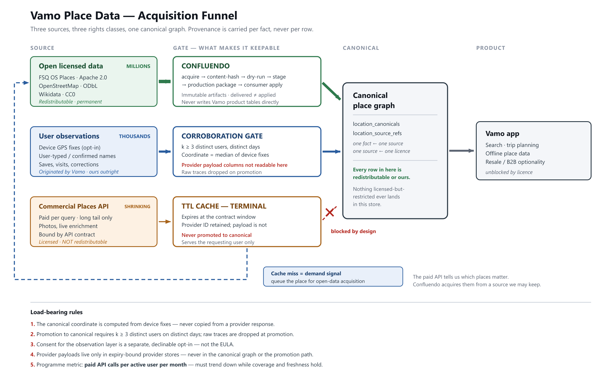

# Place Data Acquisition Strategy

> How Vamo builds an owned place graph — and where Confluendo fits

| | | | |
| --- | --- | --- | --- |
| **Owner** | Tiziano | **Date** | 3 August 2026 |
| **Status** | Draft for review | **Applies to** | Vamo place graph · Confluendo |

**Not legal advice.** Items marked ⚖ require confirmation from counsel before we rely on them commercially.

> This Markdown file is the canonical source. `Vamo_Data_Acquisition_Strategy.docx` and
> `DATA_ACQUISITION_FUNNEL.png` are generated from it and from `DATA_ACQUISITION_FUNNEL.svg` by
> `tool/docs/build_architecture_docx.mjs`. Edit this file, then regenerate — never edit the exports.

## 1. Why this document exists

Vamo's place data architecture — and Confluendo's existence — rests on a small number of assumptions about what data we are permitted to keep. Those assumptions were never written down, and one of them was wrong.

This document states them explicitly so they can be challenged, and defines the rules that follow. If any load-bearing rule in §9 turns out to be wrong, the architecture changes. That is precisely why they are written down rather than held in memory.

## 2. Correcting the founding assumption

**What we assumed:** that data received from a places provider cannot be stored, and that any durable place database must therefore be built from a wholly separate source. Confluendo was built on this premise.

**What is actually true:**

- Storage is not prohibited by law. Facts — a name, a coordinate, an address — carry no copyright. What binds us is the **contract** we accept when calling a commercial API, not statute.
- Commercial API terms generally *do* permit caching for performance within a stated window, and generally *do* permit retaining the provider's identifier indefinitely.
- What they prohibit is the clause that actually matters: **using the service to create a database or dataset.** Accumulating query results into a permanent reference store is exactly what that clause exists to prevent, because it converts per-query billing into a one-time extraction.
- The EU sui generis database right (Directive 96/9/EC) does not rescue us. Article 8 preserves a lawful user's right to extract *insubstantial* parts and Article 15 voids contract terms to the contrary — but systematically accumulating a POI layer is substantial extraction, outside that protection.

**What follows:** the original instinct was right; the statement of it was too broad. The correct formulation is not *"we cannot store their data"* but:

> We cannot accumulate licensed API data into a store that substitutes for querying it, and we cannot redistribute it. We can keep anything acquired under a licence that permits it, and anything we originate ourselves.

Confluendo is therefore not misconceived. It is the mechanism for the first half of that sentence: acquiring, at scale, data we are licensed to keep and to redistribute. Its scope is narrower than "all place data", and that narrowing is a correction rather than a reduction in value.

## 3. Three classes of data

Every fact we hold falls into exactly one of three rights classes.

| Class | Examples | Rights position | Redistribute? | Retention |
| --- | --- | --- | --- | --- |
| **Open licensed** | FSQ OS Places (Apache 2.0), OpenStreetMap (ODbL), Wikidata (CC0) | Licensed for reuse and redistribution, with attribution and — for ODbL — share-alike | Yes | Permanent |
| **Vamo-originated** | Device GPS fixes, user-typed names, confirmations, corrections, saves, visits | Ours. No third party holds rights in the facts | Yes | Permanent, subject to GDPR |
| **Licensed-restricted** | Commercial Places API responses, provider photos | Governed by the API contract, including its anti-database clause | No | TTL only |

The single most important structural decision is that these classes are tracked **per fact, not per record.** One canonical place may carry a name from OS Places, a coordinate corroborated by our own users, and a photo we may not keep at all. `location_source_refs` already models this; it must remain authoritative rather than decorative. Without that separation, every row would have to be treated at the most restrictive level of any fact inside it.

## 4. The funnel

## 5. Layer 1 — the open licensed base

**This is where independence comes from. Not from user observations.**

- **FSQ OS Places** under Apache 2.0 — on the order of 100M POIs, no redistribution restriction, no per-query cost, no expiry. This is the backbone.
- **OpenStreetMap** under ODbL adds depth, at the cost of share-alike obligations on derived databases. ⚖ This needs a decision, because it constrains resale.
- **Wikidata** under CC0 supplies identifiers and cross-references with no obligations at all.

**Acquire in bulk, not on demand.** Place-by-place acquisition will never build coverage — the arithmetic does not work at any plausible user count. The demand signal (§7) should influence *priority* within a bulk programme, never replace it.

### Confluendo's role

Confluendo is the governed path from an external dataset into Vamo's production database. The properties this strategy depends on are the ones it already has:

- **Immutable, content-addressed artifacts** — release ID and bundle SHA-256, so what was verified is provably what was applied.
- **Dry-run and staging verification before production** — a licence or schema error surfaces in a disposable environment.
- **Consumer-owned apply** — Confluendo never writes Vamo's product tables. Vamo's own function decides what lands.
- **Delivered ≠ applied as an explicit state** — so a successful delivery is never mistaken for a persisted row. The July reconciliation is the cautionary case: audit 387 recorded a successful apply for rows not present in either Vamo environment.

What Confluendo must add to serve this strategy:

1. **Licence metadata as a first-class field on every artifact**, carried through to `location_source_refs`. A fact whose licence is unknown must be unusable by construction.
2. **A persistence receipt** computed by the consumer, in the consumer's database, and read back from it — target identity, package ID, persisted row count, content hash. This is the currently open P0.
3. **An acquisition target queue** fed by the demand signal described in §7.

## 6. Layer 2 — user observations

This is the layer no competitor can buy from under us, and the one open data is worst at: whether a place still exists, has moved, or has changed its hours.

### What is ours

The user's action and everything derived from it: that a place was saved, when, in which trip, alongside what else; a name the user typed or confirmed; a device coordinate; a correction. No provider has a claim on any of it. In aggregate this is also the more commercially interesting dataset — it is demand data, and nobody else has it.

### What consent this requires ⚖

**Not the EULA.** Location is personal data. Bundling consent into terms-of-service acceptance is not valid consent under GDPR Art. 7 — it must be specific, informed, granular and freely declinable. It is also a purpose-limitation problem: *"use my location to show me what is nearby"* and *"use my location to improve Vamo's place database"* are different purposes, and the second does not ride along on the first (Art. 6(4)).

Required:

- a separate, declinable opt-in for the contribution purpose;
- no degradation of the app for users who decline;
- a plain statement of what is retained after aggregation, and what is discarded.

### The corroboration gate

Individual traces are never promoted. A fact enters the canonical graph only when **k ≥ 3 distinct users on distinct days** independently support it, and the raw observations are dropped at promotion.

This threshold does three jobs at once, which is why it is the highest-leverage decision in the layer:

- it filters GPS noise and one-off error, so data quality rises;
- it removes the canonical layer from personal-data scope, so a subject-access or erasure request never reaches the place graph;
- it makes the resulting fact defensibly ours, because it is a statistical derivation over our own observations.

### The independence rule — this one must be structurally true

The temptation in this layer is to treat a provider's coordinate as "confirmed by the user" and relabel it as ours. That is not derivation; it is relabelling, and it would not survive anyone looking at the pipeline.

The test to apply:

> Could we have produced this fact if the provider's response had been empty?

Which yields a hard implementation constraint: **the canonical coordinate must be computed from device fixes — the median of corroborating observations — and never copied from a provider response field.** The provider's role is to give the user something to point at. It is a UI affordance, not the source of the geometry. The same applies to the name: it is independent if the user typed or confirmed it, not if the provider's string was silently carried through.

This must be enforced by construction rather than convention: **the promotion job should have no read access to provider payload columns.** That is the same boundary discipline Confluendo already enforces between platform and consumer, applied one layer down — and it belongs in the same executable boundary audit.

## 7. Layer 3 — the commercial API as discovery, not storage

The paid API stays in the architecture doing one job: covering the long tail we have not yet acquired, plus live enrichment we are not permitted to hold.

- Responses live in a **TTL cache that expires at the contract window**, and serve the requesting user only.
- The **provider identifier is retained; the payload is not.**
- **Nothing in the cache is ever promoted to canonical.** This is a physical boundary, not a policy statement.

### The demand-signal loop

A cache miss is worth more as information than as data. It tells us which place our users actually want — and that fact is ours outright. Every miss should enqueue an acquisition target for Confluendo, which then acquires that place from a source we are permitted to keep.

The provider becomes a discovery channel rather than a storage source. We pay for the lookup once; we own the fact permanently, because we re-derived it from something licensed for exactly that purpose.

`recordLocationObservation` on the miss path in `supabase/functions/place-resolve/index.ts` is already this queue. Closing the loop is a matter of feeding it into Confluendo's target list rather than letting it dead-end.

## 8. Photos — deliberately deferred

User photos are the highest-risk and lowest-value element of this strategy, and are out of scope for the first phase.

- **"Marked public" is not a licence.** Reuse requires an explicit grant in our terms — worldwide, royalty-free, sublicensable, surviving account deletion. Attribution is courtesy; it is not the legal basis. ⚖
- **Photos carry third-party rights we do not control:** identifiable people (GDPR and image rights, strongly enforced in DE/FR/IT), trademarks, and — directly relevant to a travel product — restrictions on commercial use of images of cultural heritage in Italy, alongside narrow freedom of panorama in France and Italy. ⚖
- **Photos do not contribute to POI independence.** Names, coordinates, categories and opening hours do. This is the part that can wait.

## 9. Load-bearing rules

These are the invariants. If one is violated the strategy does not hold. Each should be enforceable in code or CI rather than by memory.

1. The canonical coordinate is computed from device fixes. It is never copied from a provider response.
2. Promotion to canonical requires k ≥ 3 distinct users on distinct days. Raw traces are dropped at promotion.
3. Consent for the observation layer is a separate, declinable opt-in — not the EULA, and not bundled with the "nearby" feature.
4. Provider payloads live only in expiry-bound provider stores, and never in the canonical graph or the promotion path.
5. Every canonical fact carries a licence via `location_source_refs`. A fact with unknown licence is unusable.
6. Confluendo never writes Vamo product tables. Apply is consumer-owned and returns a receipt read back from the consumer database.
7. Open-data acquisition is bulk-first. Demand signals set priority within it; they do not replace it.

The implementation contract for rules 1–5 is `docs/slices/PLACE_DATA_RIGHTS_ENFORCEMENT_PROMPT.md`.

## 10. Programme metric

**Paid API calls per active user per month.**

If it trends down while coverage and freshness hold, the strategy is working. If it stays flat, open-data acquisition is not keeping pace — and no volume of user observation will compensate. The correct response in that case is to invest in Layer 1, not Layer 2.

Instrument this before building anything else in this document. It is roughly a day's work, and it is the only signal that tells us which layer deserves the next investment.

Secondary indicators: canonical coverage measured against saved-place demand; share of canonical facts by rights class; median age of a canonical fact.

## 11. Open questions for counsel ⚖

1. **The exact terms of the commercial Places API endpoints we call today** — particularly the photo endpoints used by `destination-visual`. Caching window, identifier retention, and the precise wording of the anti-database clause.
2. **Whether ODbL share-alike on any OSM-derived component contaminates the resale case**, and whether OSM should therefore be excluded from the redistributable tier.
3. **Validity of our consent construction for the observation layer**, and whether legitimate interest is a defensible alternative basis with a documented LIA.
4. **Whether the k-anonymity threshold as designed takes the canonical store outside personal-data scope**, and what value of k is required.
5. **Photo licence grant wording**, and heritage/panorama exposure for the destinations we feature.
6. **Whether Vamo's own compilation qualifies for sui generis database right protection**, and what record of investment we should keep to support that claim.

## 12. What could break this

- **Coverage never arrives.** If bulk acquisition stalls, the API layer never shrinks and the economics never improve. This is the most likely failure mode, and the metric in §10 detects it early.
- **Rule 1 erodes quietly.** A single convenience commit that copies a provider coordinate into the promotion path converts the strategy into a laundering scheme. This must be caught by boundary audit, not by code review.
- **Consent is found invalid**, retroactively undermining the observation layer. Mitigated by keeping the canonical store aggregate-only, which bounds the exposure to raw traces.
- **ODbL contamination limits resale.** Mitigated by tracking licence per fact, so an OSM-derived subset can be excluded rather than poisoning the whole store.
