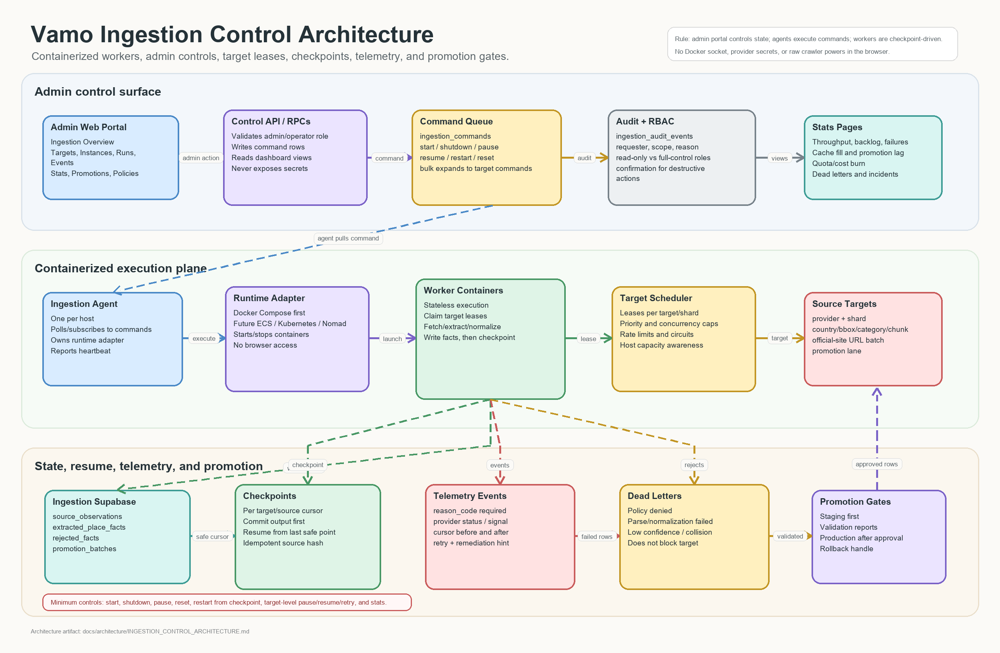

# Ingestion Control Architecture

Status: strategic design, 2026-06-26.

This document defines the scalable, containerized control plane for Vamo's place
ingestion and cache backfill system. It extends the place cache architecture with
operator controls, target-level orchestration, checkpoints, telemetry, and admin
dashboard pages.



## Goal

Run ingestion continuously and safely without turning the admin web portal into a
container host, a scraper console, or a secret manager.

The admin portal should control and observe ingestion. The ingestion agent should
execute commands. Supabase should be the auditable state plane.

## Architecture Decision

Use a **containerized worker fleet plus a narrow ingestion-agent boundary**.

- Workers run in containers, initially on a dedicated PC with Docker Compose.
- The same contract can move to a cloud VM, ECS, Kubernetes, or another scheduler
  because the dashboard talks to an ingestion control API/state model, not Docker
  directly.
- The admin web portal never receives Docker socket access, provider secrets, or
  raw crawler privileges.
- Supabase stores targets, commands, leases, checkpoints, telemetry events, stats,
  and audit history.

This is an adapter/gateway architecture: product/admin UI calls a Vamo control
surface; orchestration details stay behind the ingestion agent.

## Runtime Topology

```text
Admin web portal
  -> ingestion control API / RPCs
  -> Supabase control tables
  -> ingestion agent on host
  -> container runtime adapter
  -> ingestion worker containers
  -> ingestion Supabase project
  -> validation + promotion
  -> Vamo staging
  -> Vamo production
```

The first deployment can be one dedicated PC running Docker Compose. Scaling means
adding more agents/hosts and letting targets lease work across them. The control
contract stays the same.

## Control Plane Components

### Admin Web Portal

Dedicated admin section: **Ingestion & Cache**.

Pages:

- **Overview:** global state, active instances, paused targets, failed targets,
  throughput, backlog, cache fill rate, promotion status, and recent incidents.
- **Targets:** one row per ingestion target with status, source, policy, priority,
  checkpoint, lag, owner instance, and controls.
- **Instances:** one row per worker/agent/container instance with host, image,
  version, heartbeat, current target, resource usage, and controls.
- **Runs & Events:** timeline of runs, state transitions, failures, signals,
  retries, dead letters, and promotion batches.
- **Stats:** current and historical source stats, rows fetched/extracted/rejected,
  cache hit/fill rates, cost/quota burn, provider throttling, and promotion yield.
- **Policies:** target rate limits, concurrency, source enablement, provider
  cache policy, TTLs, and kill switches.

### Ingestion Control API

The admin portal calls a thin server-side API/RPC layer. It:

- validates `is_admin` and eventually role-specific operator permissions;
- writes commands into `ingestion_commands`;
- reads summarized views for dashboard pages;
- never exposes service-role keys or worker secrets to the browser;
- records every operator action in `ingestion_audit_events`.

### Ingestion Agent

Runs on each ingestion host. It:

- polls or subscribes to pending commands;
- owns the host/container runtime adapter;
- starts, stops, pauses, resumes, resets, and upgrades worker containers;
- emits heartbeats and instance telemetry;
- writes command acknowledgements and execution results;
- never promotes directly into production.

### Worker Containers

Workers are stateless except for their leased target and checkpoint. They:

- claim one or more targets through leases;
- read source policy and target config;
- fetch/extract/normalize according to provider policy;
- write source observations and extracted facts into the ingestion Supabase
  project;
- update checkpoints after idempotent writes;
- emit structured events on every stop/failure signal.

## Data Model Intent

The names below are conceptual; implementation can group or split them as needed.

| Table | Purpose |
| --- | --- |
| `ingestion_targets` | Source/dataset/region/category unit of work; status, priority, policy, desired state. |
| `ingestion_instances` | Registered agents/containers; host, image, version, heartbeat, state. |
| `ingestion_commands` | Admin/API commands: start, shutdown, pause, resume, reset, restart, upgrade. |
| `ingestion_leases` | Target ownership with expiry; prevents two workers from writing the same shard. |
| `ingestion_runs` | One execution attempt for a target; state, timestamps, image version, counts. |
| `ingestion_checkpoints` | Last durable cursor per target and source; resume anchor. |
| `ingestion_events` | Immutable telemetry: state changes, provider signals, errors, retries, operator actions. |
| `ingestion_dead_letters` | Records that failed normalization, policy, or promotion after retries. |
| `ingestion_stats_daily` | Rollups for dashboard stats and trend lines. |
| `promotion_batches` | Validated movement from ingestion project to staging/production. |

Control tables are admin/service-role only. Clients never access them directly.
Dashboard views should be read-optimized and PII-free.

## Required Controls

### Instance Controls

Minimum controls:

- **Start:** create or resume worker containers for selected scope.
- **Shutdown:** graceful drain, flush checkpoint, release leases, stop containers.
- **Pause:** stop fetching new records while preserving checkpoint and leases long
  enough for a controlled resume.
- **Reset:** admin-only destructive command that clears local runtime state and
  optionally rewinds a target checkpoint after confirmation.
- **Restart:** stop and start from the last committed checkpoint.
- **Upgrade image:** roll one instance or canary group to a new container image.

All controls produce:

- command id;
- requester;
- target/instance scope;
- requested state;
- result state;
- timestamps;
- event trail;
- rollback or resume instructions when applicable.

### Target Controls

Targets are the operator's real unit of control. A target may be:

- a provider/source, such as `wikidata`, `fsq_os_places`, `geonames`, or
  `official_site`;
- a shard, such as country, bounding box, category, dataset chunk, or URL batch;
- a promotion lane, such as ingestion-to-staging or staging-to-production.

Minimum target controls:

- enable/disable target;
- pause/resume target;
- assign priority;
- set concurrency cap;
- set rate limit policy;
- drain target after current record;
- retry failed target from checkpoint;
- quarantine target when failures exceed threshold;
- reset checkpoint with explicit confirmation and audit reason.

The dashboard must support bulk controls, but every bulk action expands into
per-target commands for audit and partial failure handling.

## Failure Telemetry

Every stop must have a reason. "Stopped" is not enough.

Required signal taxonomy:

- `operator_pause`
- `operator_shutdown`
- `operator_reset`
- `lease_expired`
- `host_lost`
- `container_exit`
- `image_pull_failed`
- `source_429`
- `source_403`
- `source_5xx`
- `source_timeout`
- `robots_disallow`
- `policy_denied`
- `parse_error`
- `normalization_error`
- `checkpoint_conflict`
- `supabase_write_failed`
- `promotion_validation_failed`
- `quota_exhausted`
- `circuit_open`
- `unknown_error`

Each event should carry:

- target id;
- run id;
- instance id;
- container id/image digest;
- source/provider;
- cursor before and after;
- retry count;
- HTTP status or provider error code when applicable;
- normalized `reason_code`;
- human-readable message;
- remediation hint;
- whether automatic retry is allowed.

## Checkpoint And Resume

Resume must be deterministic and idempotent.

Rules:

- Workers commit output first, then checkpoint.
- Checkpoints are per target and per source cursor, not global.
- Every extracted fact has a deterministic key such as
  `(provider, source_id, source_hash)`.
- Reprocessing the last page/chunk is acceptable; duplicate writes must collapse
  through upsert/idempotency.
- A failed run resumes from the last committed checkpoint by default.
- Reset may rewind to an earlier checkpoint, but only with an audit reason.
- Dead-letter records do not block the whole target; they are counted and exposed
  in the dashboard.

For sources without stable cursors, use chunk manifests with deterministic chunk
ids and content hashes.

## Stats Page

The stats page should answer operational and business questions.

Minimum cards:

- active targets;
- paused targets;
- failed targets;
- running instances;
- stale heartbeats;
- records fetched/extracted/promoted today;
- rejection rate;
- dead-letter count;
- cache fill rate;
- provider throttles;
- promotion lag to staging/production;
- estimated provider/API cost or quota burn.

Useful charts:

- throughput by source over time;
- failure reasons over time;
- target backlog by priority;
- cache coverage by country/category;
- promotion yield by source;
- retry success rate;
- top collision/low-confidence sources.

## Admin UX Shape

The admin section should be dense and operational, not a marketing-style page.

Suggested navigation:

- `Ingestion Overview`
- `Targets`
- `Instances`
- `Runs`
- `Events`
- `Promotions`
- `Stats`
- `Policies`

Important UI behaviors:

- require confirmation for reset, rewind, production promotion, and bulk actions;
- show the exact target count affected before applying a command;
- show "last safe checkpoint" and "resume from" before restart;
- show stop reason and remediation hint inline on failed targets;
- make every command traceable to an audit row;
- provide a read-only mode for support users and full-control mode only for
  founder/admin operators.

## Scaling Model

Phase 1: **Single host / Docker Compose**

- one dedicated PC or cloud VM;
- one ingestion agent;
- multiple worker containers;
- target leases in Supabase;
- admin portal controls through command rows.

Phase 2: **Multi-host**

- multiple agents register into `ingestion_instances`;
- target leasing balances work;
- rate limits remain source-global through the control tables;
- scheduler chooses host based on capacity and target affinity.

Phase 3: **Managed scheduler**

- adapter swaps from Docker Compose to ECS/Kubernetes/Nomad;
- command model remains stable;
- workers remain stateless and checkpoint-driven.

## Security And Governance

- Admin portal never talks directly to the Docker socket or Kubernetes API.
- Service-role keys stay server-side and agent-side only.
- Agent registration uses a scoped machine token, rotated independently from
  provider credentials.
- Provider credentials stay in the host secret store or deployment platform, not
  in dashboard rows.
- All commands and policy changes produce immutable audit events.
- Production promotion requires an explicit gate and can be made two-person later.
- Raw payload storage follows provider policy; prohibited payloads are hashed and
  discarded.

## Suggested Additional Features

Beyond the bare minimum:

- canary mode for new source policies or worker images;
- dry-run ingestion that extracts and validates without promotion;
- source-level circuit breakers;
- SLA alerts for stale targets and promotion lag;
- budget/quota guardrails shared with the provider control plane;
- replay sandbox for failed records;
- schema/version compatibility checks before worker startup;
- target ownership notes, so an operator can document why a target is paused;
- exportable incident report for provider/account support.

## Acceptance Criteria For The First Build Slice

- Admin can view all targets across all instances in one table.
- Admin can start, pause, shutdown, restart, and reset an instance.
- Admin can pause/resume/retry one target without touching others.
- A failed target shows the stop reason, signal/event, cursor, retry count, and
  suggested next action.
- Restart resumes from the last committed checkpoint and does not duplicate
  promoted rows.
- Stats page shows target counts, run counts, throughput, failures, rejection
  rate, cache fill rate, and promotion lag.
- All commands are audited with requester, scope, timestamp, and result.
- The dashboard cannot access container runtime credentials or provider secrets.

## Related Docs

- [Place Cache Architecture](PLACE_CACHE_ARCHITECTURE.md)
- [Place Enrichment](../design/PLACE_ENRICHMENT.md)
- [Provider Control Plane](PROVIDER_CONTROL_PLANE.md)
- [Premium Services Control Plane](../specs/premium-services-control-plane.md)
