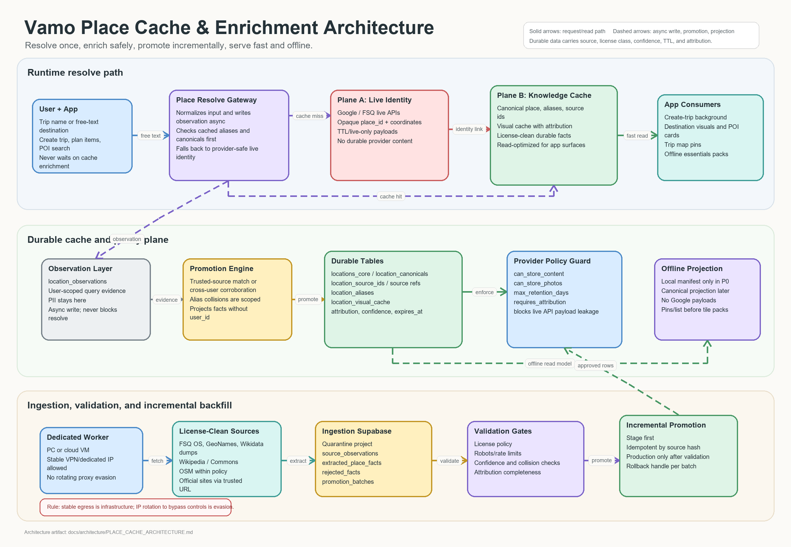

# Place Cache Architecture

Status: strategic design, 2026-06-26.

This document is the **overview companion** to the cache architecture diagram. It
owns the high-level model and the runtime/consumer view. The granular rules live in
sibling docs and are referenced — not restated — here, so there is one home per rule:

- enrichment pipeline, ingestion schema, promotion mechanics, and provider policy
  registry → [Place Enrichment](../design/PLACE_ENRICHMENT.md);
- ingestion execution, operator controls, checkpoints, and telemetry →
  [Ingestion Control Architecture](INGESTION_CONTROL_ARCHITECTURE.md).



## Purpose

The place cache is a product asset, not just a performance optimization. It lets
Vamo:

- resolve free-text trip destinations and POIs quickly;
- avoid repeated paid/live provider calls for facts we can legally own;
- provide create-trip backgrounds, destination visuals, POI cards, map pins, and
  offline packs from one durable knowledge layer;
- preserve source attribution and license controls at the row level;
- keep user observations and global cache promotion structurally separate.

Cache effectiveness must be **measurable, not asserted.** Resolve hit/miss and any
Plane-A provider call emit to the provider-control-plane ledger (feature, provider,
cache status, latency, cost) per [Provider Control Plane](PROVIDER_CONTROL_PLANE.md),
so we can show the hit rate and the live-API spend the cache avoids.

## Core Principle

Identity and content are separate planes.

- **Plane A: Live identity.** Provider APIs can resolve "what place is this" and
  return an opaque provider id plus coordinates. Live payloads are TTL-bound and
  cannot become durable content unless the provider policy explicitly allows it.
- **Plane B: Durable knowledge.** Open, attributed, or otherwise cacheable facts
  land in Vamo-owned canonical tables and visual cache rows. This is what app
  surfaces read from.

The link between the planes is a provider/source id — a pointer, not a copied
provider payload. The DB guard (`can_store_content = false` for `live_api` sources,
`location_visual_cache.cache_policy = 'live_only'` for Google) makes writing a live
payload into Plane B structurally impossible — enforced today by
`location_provider_policies` in
`supabase/migrations/20260625155733_place_intelligence_cache.sql`.

## Runtime Resolve Path

Synchronous read/resolve — trip creation completes on this path:

1. The user enters a trip name, destination, POI, or natural-language place input.
2. `place-resolve` normalizes the query and checks cached aliases/canonicals.
3. On a cache hit, the app reads Plane B directly and returns.
4. On a cache miss, live identity providers may return an opaque place id and
   coordinates, which are returned to the user immediately.

**Asynchronous side-effects** — trip creation never blocks on these:

- the miss records a user-scoped `location_observation` (the enrichment flywheel);
- `place-enrich` fills Plane B from license-clean sources;
- the promotion engine may later project corroborated facts into the global plane.

## Durable Cache Plane

The durable layer is made of:

- `location_observations`: user-scoped evidence. This may carry `user_id`; it is
  not the global cache.
- promotion engine: projects trusted-source matches or cross-user corroborated
  observations into shared rows.
- canonical tables: `location_canonicals` / `location_source_refs`,
  `location_aliases`, and `location_visual_cache`.
- provider policy guard: source-level controls such as `can_store_content`,
  `can_store_photos`, `max_retention_days`, and `requires_attribution`.
- offline projection: app-local read model that never carries Google/live-only
  payloads.

> Naming: the deferred literal-spec slice renames `location_canonicals` →
> `locations_core` and `location_source_refs` → `location_source_ids` (and adds
> PostGIS `geom`/GiST + pg_trgm). This doc uses the current names; treat the target
> names as aliases until that slice lands. See
> [Place Enrichment §1](../design/PLACE_ENRICHMENT.md).

### Promotion is the cache-poisoning gate

Promotion must physically exclude user identifiers from global tables. The shared
cache receives projected facts only: source, source id or URL, attribution, license
class, confidence, timestamps, and cache policy.

A **single** user's observation must never promote on its own. A fact derived from
user evidence reaches the global plane only via a trusted-source match **or**
cross-user corroboration above a distinct-user threshold. This is both a privacy
control (no single user's identity or activity is inferable from a global row) and
the primary defense against one actor poisoning the shared knowledge layer.

## Ingestion And Backfill Plane

Large-scale enrichment runs through a separate, quarantined ingestion plane —
audited, throttled, replayable, and discardable without polluting user-facing data:

```text
dedicated ingestion worker
  -> ingestion Supabase project (quarantine)
  -> validation and policy gates
  -> Vamo staging
  -> Vamo production
```

The ingestion project stores source observations, extracted facts, rejected facts,
and promotion batches. Staging and production receive only validated normalized rows
through idempotent promotion jobs — never direct crawler writes.

Two sibling docs own the detail this overview only sketches:

- the **ingestion schema**, source-priority order, and per-source policy →
  [Place Enrichment §4](../design/PLACE_ENRICHMENT.md);
- the **operator control plane** — worker fleet, target leasing, checkpoints,
  failure telemetry, and admin dashboard →
  [Ingestion Control Architecture](INGESTION_CONTROL_ARCHITECTURE.md).

## Network Stance

Stable egress is infrastructure; rotation to avoid provider controls is evasion.
**Allowed:** a dedicated PC or cloud VM, a stable VPN or dedicated IP, fixed egress
region for QA/allow-listing, real Vamo user-agent, source-specific rate limits,
backoff, and audit logs. **Not allowed:** rotating VPN/proxy pools, residential
proxies, CAPTCHA bypass, fingerprint spoofing, or retrying through new IPs after a
source throttles or blocks us. Full rationale and the compliance guardrails are in
[Place Enrichment §4–§5](../design/PLACE_ENRICHMENT.md).

The reason is architectural as much as legal: every row in production must be
explainable — how it was obtained, why it can be stored, how to attribute it, and
how to roll it back.

## Promotion Rules

Detailed mechanics live in
[Place Enrichment §4 — Promotion rules](../design/PLACE_ENRICHMENT.md). The
load-bearing invariants:

- Promote to staging first; production only after validation succeeds.
- Every promotion is idempotent by `(provider, source_id, source_hash)`.
- Never overwrite higher-confidence user-confirmed or trusted-source data without
  a recorded reason.
- Every batch reports added/updated/skipped/rejected rows, attribution changes, and
  collision warnings, and keeps a rollback handle.

## Refresh And Staleness

"Durable" means owned, not frozen. Open-licensed facts (Wikidata, OSM) change over
time and need a refresh story — fixed TTL vs. change-feed is an open decision
(see [Place Enrichment §8](../design/PLACE_ENRICHMENT.md), Q4). Live Plane-A payloads
always expire via `max_retention_days`; only the open/owned plane is durable, and
even it is subject to periodic re-validation.

## App Consumers

The durable knowledge cache feeds:

- create-trip destination backgrounds;
- destination visual fallback;
- POI cards and details;
- trip map pins;
- offline essentials and future offline place projections.

App consumers read durable cache projections. They should not know whether a row was
originally observed by a user, seeded from an open dataset, enriched from Wikidata,
or promoted through ingestion.

## Related Docs

- [Place Enrichment](../design/PLACE_ENRICHMENT.md) — source of truth for enrichment
  pipeline, ingestion schema, promotion mechanics, and provider policy registry.
- [Ingestion Control Architecture](INGESTION_CONTROL_ARCHITECTURE.md) — operator
  control plane that executes the ingestion sketched here.
- [Provider Control Plane](PROVIDER_CONTROL_PLANE.md) — telemetry/cost ledger this
  cache reports into.
- [Provider Resilience](../design/PROVIDER_RESILIENCE.md) — rate limits, backoff,
  and failure handling for the providers above.
