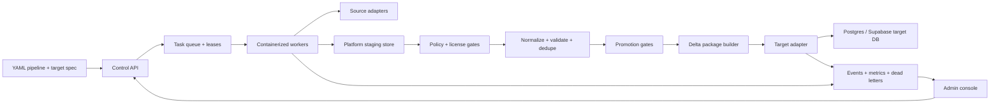

# Ingestion Platform Architecture

Status: strategic architecture draft - 2026-06-26.

This document defines the ingestion system as a reusable platform that happens
to be incubated inside the Vamo repo. Vamo is the first consumer and target
project. Vamo is not the provider, not the platform boundary, and not the
reason the ingestion engine should be coupled to one product schema.

## 1. Product Thesis

The ingestion platform should take a declarative project schema, run a governed
ingestion pipeline, and ship validated records into one or more target databases.
The first target engines are PostgreSQL and Supabase/Postgres. Later targets
should be adapter work, not a rewrite.

The platform owns:

- Source acquisition and checkpoints.
- Policy-aware caching and attribution.
- Validation, normalization, dedupe, and promotion.
- Operator controls and telemetry.
- Incremental shipment into target projects.

The consumer owns:

- Product-specific canonical schema.
- Product-specific promotion thresholds.
- Target database credentials and migration approval.
- UI and product behavior that read the shipped data.

For Vamo, the first consumer schema is place intelligence: locations, POIs,
source references, aliases, visuals, attribution, and safe provider policy.

## 2. Boundary Decision

Keep the platform source-neutral and target-neutral.

Do not create a "Vamo scraper." Create an ingestion platform with a Vamo target
profile.

Recommended future repo shape:

```text
ingestion-platform/
  apps/
    admin-console/
    control-api/
    worker/
  packages/
    core/
    spec/
    policy/
    telemetry/
    adapters-source/
    adapters-target/
    adapters-transform/
  pipelines/
    examples/
  targets/
    examples/
  docs/
```

Temporary in-repo shape while incubating inside Vamo:

```text
docs/platform/ingestion/
  README.md
  ARCHITECTURE.md
  BUILD_SLICES.md
web/packages/ingestion-platform/
  spec/
  core/
  policy/
  adapters/
  fixtures/
web/apps/confluendo-console/         # Confluendo operator console
web/apps/site/                       # Vamo web/consumer shell
```

Implementation code belongs under `web/packages/ingestion-platform/` until the
standalone repo split. Do not mix ingestion platform code into Vamo Flutter
screens, Vamo feature packages, Vamo Supabase edge functions, or the Vamo web
admin route unless it is a thin consumer adapter/read model.

## 3. Architecture Overview



The platform has two databases in the long term:

- **Platform control database**: pipeline specs, runs, worker leases,
  checkpoints, staging rows, dead letters, artifacts, policy evaluations,
  shipments, and telemetry.
- **Consumer target database**: the product database that receives promoted
  records. For Vamo this is the Vamo Supabase/Postgres project.

The control database should not be assumed to be the same database as the
consumer target. During early incubation it can be the same Supabase project for
speed, but the schema boundary must stay explicit.

## 4. Core Runtime Components

### Control API

The control API is the only mutation boundary for the admin console. It owns:

- Start, pause, shutdown, and reset commands.
- Target-level enable/disable and priority changes.
- Run creation and cancellation.
- Lease issuance and revocation.
- Audit log writes.

Browser code never gets database superuser credentials, Supabase service-role
keys, provider secrets, or direct worker credentials.

### Worker Pool

Workers are stateless containers with durable checkpoints. They can run on a
dedicated PC, a small VM, or a cloud container platform.

Worker requirements:

- Claim one task through a lease.
- Fetch one bounded page or batch.
- Normalize to a staging model.
- Commit checkpoint after durable staging write.
- Emit telemetry for every state transition.
- Exit safely when paused or shutdown.

The worker can crash at any point and restart from the last committed checkpoint.

### Platform Staging Store

The staging store is the durable intermediate layer. It contains source facts
before promotion to a product target.

It should keep:

- Raw-ish provider/source reference when policy permits.
- Normalized candidate facts.
- Source identifier and source version.
- Attribution and license metadata.
- Policy evaluation result.
- Checkpoint and ingestion run identity.
- Error and dead-letter metadata.

It must not leak user identifiers into global promoted cache tables. User
observations can exist in an observation layer, but global promotion is a
projection that structurally cannot copy PII.

### Policy Engine

The policy engine is a first-class component, not a comment in the worker.

It evaluates:

- Whether a payload can be stored.
- Retention windows and TTLs.
- Required attribution.
- Whether photos/media bytes can be stored.
- Whether only provider IDs can be stored.
- Whether the target requires live-only usage.
- Whether a source can be used for global cache promotion.

For example: FSQ Open Source Places, GeoNames, and Wikidata/Wikimedia can seed a
durable cache when their license and attribution fields are modeled. Google
Places content remains live-only unless a future policy slice explicitly models
permitted retention, attribution, and map/content requirements.

### Promotion Engine

Promotion turns staged facts into consumer-ready canonical records.

Promotion must support:

- Trusted source match promotion.
- Cross-user corroboration where observations are involved.
- Collision handling by geography, feature type, and source confidence.
- Manual review states.
- Reversible merges.
- PII-free global projections.

For Vamo place intelligence, a single user's repeated phrase can improve that
user's scope but cannot mutate the shared global alias layer by itself.

### Target Shipment Engine

Shipment moves promoted deltas into consumer target projects.

Shipment requirements:

- Idempotent upsert/delete operations.
- Per-target schema version checks.
- Dry-run diff before production shipment.
- Staging-first promotion path.
- Per-row result ledger.
- Resume after partial failure.
- Rollback strategy for reversible shipments.

The target engine must support at least:

- **PostgreSQL direct**: DSN-based connection, schema-qualified upserts,
  migrations or compatibility checks.
- **Supabase/Postgres**: server-side database connection or trusted service
  boundary, explicit grants where Data API exposure is needed, RLS enabled on
  exposed schemas, and no service-role secret in browser code.

Future target adapters can include BigQuery, Snowflake, S3/Parquet, Elasticsearch,
or a consumer API, but those should plug into the same shipment contract.

## 5. Declarative YAML Spec

The platform should be driven by versioned YAML specs. Specs should be strict
enough to validate before a worker starts and expressive enough to avoid code
changes for ordinary new ingestion jobs.

Example pipeline spec:

```yaml
apiVersion: ingestion.platform/v1alpha1
kind: Pipeline
metadata:
  id: places-fsq-italy
  owner: place-intelligence
  description: FSQ OS Places seed for Italy POIs

source:
  adapter: object_snapshot
  format: parquet
  uriSecret: FSQ_OS_PLACES_ITALY_URI
  license:
    id: apache-2.0
    attribution: "Foursquare Open Source Places"
    canStoreContent: true
    canStoreSourceIds: true
    canStoreMediaBytes: false
    retentionDays: null

cursor:
  strategy: monotonic_row_id
  field: fsq_place_id
  checkpointEveryRows: 1000

entity:
  type: place
  naturalKeys:
    - source_id
    - normalized_name
    - geom

mapping:
  sourceId: fsq_place_id
  name: name
  latitude: latitude
  longitude: longitude
  category: category_label
  address: address.formatted
  countryCode: country

transforms:
  - type: normalize_text
    fields: [name, address]
  - type: category_bucket
    sourceField: category
    targetField: feature_type
  - type: point_geometry
    latField: latitude
    lngField: longitude
    targetField: geom

qualityGates:
  - type: required_fields
    fields: [sourceId, name, latitude, longitude]
  - type: coordinate_bounds
  - type: policy_storage_allowed
  - type: duplicate_window
    scope: "countryCode,feature_type,normalized_name"

promotion:
  mode: trusted_source
  targetCanonical: locations_core
  reviewOnCollision: true

shipment:
  package: places-core-delta
  targetRefs:
    - vamo-staging
```

Example target spec:

```yaml
apiVersion: ingestion.platform/v1alpha1
kind: TargetProject
metadata:
  id: vamo-staging
  consumer: vamo

engine:
  adapter: supabase_postgres
  dsnSecret: VAMO_STAGING_CANARY_APP_DATABASE_URL
  serviceRoleSecret: VAMO_STAGING_SERVICE_ROLE
  exposedSchemas:
    - public

contract:
  schemaVersion: 2026-06-place-cache-v1
  migrationMode: verify_only
  defaultWriteMode: upsert

tables:
  locations_core:
    schema: public
    primaryKey: id
    upsertKey: canonical_key
  location_source_refs:
    schema: public
    primaryKey: id
    upsertKey: "source,source_id"

security:
  requireRlsOnExposedTables: true
  requireExplicitDataApiGrants: true
  forbidBrowserServiceRole: true

promotion:
  allowProductionShipment: false
  requireDryRun: true
  requireAuditReason: true
```

The YAML spec is not a replacement for code. It is the contract that selects
adapters and declares policy. Source adapters, transforms, policy checks, and
target adapters still live in typed code and are selected by name.

## 6. Control Plane Data Model

Recommended platform-control tables:

| Table | Purpose |
| --- | --- |
| `ingestion_projects` | Logical consumers such as Vamo, future projects, or sandbox targets. |
| `ingestion_specs` | Versioned YAML specs, validation status, active revision. |
| `ingestion_sources` | Source registry, license/policy metadata, source health. |
| `ingestion_targets` | Target DB/project registry, engine adapter, schema contract. |
| `ingestion_runs` | Pipeline run instance, status, requested by, start/end timestamps. |
| `ingestion_tasks` | Work units claimed by workers. |
| `ingestion_worker_leases` | Container/worker lease ownership and heartbeat. |
| `ingestion_checkpoints` | Durable per-target cursor state. |
| `ingestion_events` | Operator-readable event stream and failure signals. |
| `ingestion_dead_letters` | Failed records with classification and retry policy. |
| `ingestion_artifacts` | Snapshot files, delta packages, manifests, checksums. |
| `ingestion_policy_evaluations` | Decision ledger for storage/retention/promotion. |
| `ingestion_promotions` | Candidate-to-canonical promotion outcomes. |
| `ingestion_shipments` | Delta package shipment to target project/environment. |
| `ingestion_shipment_items` | Per-row apply result, retry, and error detail. |
| `ingestion_audit_log` | Admin commands and target mutations. |

These names are platform names, not Vamo product names. Vamo-specific tables sit
behind a target adapter or consumer schema profile.

## 7. Operator Console Requirements

The admin console should manage the platform control plane, not write directly
to provider or target databases.

Minimum P0 operator features:

- Start, shutdown, pause, and reset worker instances.
- See all targets across all worker instances.
- Control ingestion for one target without stopping the entire cluster.
- See telemetry for why a target stopped: policy block, provider throttle,
  invalid payload, license review, schema mismatch, worker crash, target write
  failure, or operator pause.
- Restart from the last committed checkpoint.
- See current stats: cache yield, rows staged, rows promoted, rows shipped,
  policy blocks, dead letters, quota burn, and shipment lag.

Recommended next features:

- Dry-run shipment diff.
- Target schema compatibility panel.
- Promotion review queue.
- Dead-letter replay.
- Policy simulation for a source before enabling it.
- Provider/source quota ledger.
- Per-target circuit breaker.
- Production shipment approval workflow.

The current Vamo web admin at `/admin/ingestion` is the first consumer-hosted
operator console. Auth, MFA, live read, and audited control-plane mutations are
implemented; production target writes remain gated behind dry-run, staging
approval, and shipment policy.

Target selection, AI-assisted scheduling, and progressive run tiers are defined
in `TARGET_SELECTION_AND_SCHEDULING.md`.

## 8. Source Strategy

Prefer sources in this order:

1. Open datasets with durable usage rights and attribution.
2. Consumer-owned data and user-confirmed observations.
3. Provider APIs whose cache/storage policy is explicitly modeled.
4. Live-only providers for visualization or validation when retention is not
   allowed.

The system should support source adapters for:

- Object snapshots: CSV, JSONL, Parquet, GeoJSON.
- HTTP APIs with cursor or pagination.
- SQL sources.
- Manual upload/import.
- Internal observation streams.
- AI-assisted normalization or resolution.

FSQ OS Places is the first commissioned source path, not a platform-wide source
choice. GeoNames, Wikidata/Wikimedia geodata, approved official geographic
releases, customer imports, and other provider adapters each need their own
source profile, rights evidence, release validation, canonicalization rule, and
consumer-contract approval before they can contribute durable facts. See
`POST_VAMO_PLATFORMIZATION.md` for the post-Vamo source-portfolio plan.

AI can help resolve ambiguity, map schemas, classify categories, and propose
matches. AI output is not automatically a trusted source of durable facts unless
the spec says the output is derivative-only or a human/policy gate approves it.

## 9. Network And Compliance Stance

The platform can run from a dedicated PC or controlled host with stable egress.
It must not rely on rotating VPN/proxy evasion.

Allowed:

- Static egress IP for allowlists and auditability.
- Provider-compliant rate limiting.
- Backoff and circuit breakers.
- Downloading open datasets through documented channels.
- Manual approval where source terms require it.

Not allowed:

- Rotating identities to bypass rate limits.
- Scraping behind access controls or paywalls.
- Ignoring robots, terms, or source license constraints.
- Storing provider content when the policy engine says live-only.

Efficiency comes from cache design, delta processing, checkpoints, and choosing
cacheable sources. It should not come from hiding traffic patterns.

## 10. Shipment Flow

The target shipment lifecycle:

1. Build a delta package from promoted rows.
2. Validate package manifest and checksums.
3. Verify target schema compatibility.
4. Dry-run against staging target.
5. Apply idempotent writes to staging.
6. Compare row counts, checksums, and policy statistics.
7. Promote the same package to production only after approval.
8. Record per-row shipment results and package-level audit trail.

For Vamo:

```text
Platform staging
  -> Vamo staging Supabase/Postgres
  -> Vamo production Supabase/Postgres
```

The same mechanism should work for a non-Vamo consumer:

```text
Platform staging
  -> Customer/project staging Postgres
  -> Customer/project production Postgres
```

## 11. Security Model

Security rules:

- Admin UI uses normal admin auth, never raw target credentials.
- Control API resolves admin authorization and writes audit records.
- Workers receive only the secrets needed for the claimed task.
- Target credentials are scoped per environment.
- Supabase service-role keys never enter browser bundles.
- Tables in Supabase exposed schemas require RLS before any public/authenticated
  access.
- Data API exposure must be explicit where needed; grants are not assumed.
- PII-bearing observations stay separate from global promoted cache tables.
- Audit logs are append-only.

For Supabase targets, the adapter should default to server-side Postgres writes
or a trusted service boundary. Direct Data API writes should be used only when
the target contract explicitly grants the roles, RLS policies, and exposed
schema behavior required for that workflow.

## 12. Reliability Model

The system should be recoverable by construction:

- Every task has a lease and heartbeat.
- Every source batch has a checkpoint.
- Every target shipment is idempotent.
- Every failure has a classified event.
- Every dead-letter row has a replay policy.
- Every target write has a result ledger.

Failure classes:

- `source_unavailable`
- `source_throttled`
- `source_policy_block`
- `payload_invalid`
- `license_review_required`
- `schema_mismatch`
- `worker_lost`
- `target_unavailable`
- `target_write_failed`
- `checkpoint_conflict`
- `operator_pause`

The dashboard should explain the class, the exact target, the checkpoint, the
last durable write, and the allowed next action.

## 13. Vamo Consumer Profile

Vamo's first profile should be named explicitly as a consumer:

```yaml
consumer: vamo
domain: place_intelligence
targetTables:
  - locations_core
  - location_source_refs
  - location_aliases
  - location_visual_cache
  - location_observations
```

Vamo-specific rules:

- Global promoted tables cannot hold user identifiers.
- User observations remain user-scoped until trusted-source match or cross-user
  corroboration.
- Google content remains live-only unless a later policy slice changes that.
- Attribution is stored per source row.
- Trip creation and visual resolution never block on ingestion.
- The Vamo app reads shipped cache rows; it does not own the ingestion runtime.

## 14. Phasing

### Phase 0 - Architecture And Mockup

- Draft architecture.
- Start `/admin/ingestion` as a static visual shell.
- Decide platform-control schema names and YAML spec shape.
- Decide repo boundary for incubation code.

### Phase 1 - Spec And Dry Run Core

- Implement YAML parser and validator.
- Implement platform-control schema locally.
- Implement a no-network fixture source adapter.
- Implement Postgres target dry-run adapter.
- Emit runs, checkpoints, events, and dead letters.

### Phase 2 - Supabase/Postgres Shipment

- Add Supabase/Postgres target adapter.
- Add staging shipment to a sandbox target.
- Add schema compatibility checks.
- Add idempotent upsert ledger.
- Keep production writes disabled.

### Phase 3 - Worker Pool And Admin Control

- Containerize worker.
- Add leases, pause/resume, shutdown, reset.
- Wire the admin console to the control API.
- Add target-level controls and stats.

### Phase 4 - Vamo Place Intelligence Consumer

- Add Vamo consumer profile.
- Add open dataset source adapters needed for place cache.
- Select a bounded target through the scorecard and run a progressive dry run.
- Ship first staged place deltas to Vamo staging after approval.
- Promote to production after validation.

### Phase 5 - Standalone Repo Fork

- Move platform code into a new ingestion-platform repo.
- Leave Vamo with target specs, consumer profile, and deployment integration.
- Preserve shared docs and examples as versioned package artifacts.

## 15. Open Decisions

1. Platform database location during incubation: Vamo Supabase sandbox, local
   Postgres, or a separate Supabase project.
2. YAML spec validation language: JSON Schema, Zod, TypeBox, or equivalent.
3. Initial queue: Postgres leases table, Supabase Queues, or external queue.
4. Container runtime: dedicated PC Docker Compose first, then cloud container
   runner later.
5. Delta package format: database tables only, signed JSONL, or Parquet +
   manifest.
6. Whether the standalone repo should be open-source, private infra, or split
   core/private adapters.

## 16. Immediate Recommendation

Before the first real Vamo ingestion run:

1. Merge the current Confluendo auth/control-console fixes.
2. Keep the target-selection and AI-scheduling criteria explicit in
   `TARGET_SELECTION_AND_SCHEDULING.md`.
3. Run the control-plane SQL smoke in CI against disposable Postgres.
4. Then execute a bounded Vamo progressive dry run: preflight, scout, sample
   dry-run, dashboard review, and only then staging canary approval.

That gives us live operational confidence without prematurely enabling broad
provider traffic or production target writes.

## 17. Embeddable Product Strategy

The larger product opportunity is not only a standalone ingestion app. It is an
ingestion and caching control plane that can extend another product's existing
admin dashboard.

The platform should support three integration modes:

1. **Embedded console package**: a React/Next module or web component that a
   product team can mount inside its existing admin portal.
2. **Hosted console**: a separate operator console for teams that do not have an
   admin dashboard yet.
3. **Headless control API**: APIs and webhooks for teams that want to build their
   own console but reuse the worker, policy, checkpoint, and shipment engine.

Commercial packaging should follow that boundary:

| Package | Customer value |
| --- | --- |
| Open-core worker runtime | Trust, self-hosting, and local control of source/target credentials. |
| Embedded admin console | Fast adoption inside an existing internal tool. |
| Managed control plane | Hosted scheduling, audit, telemetry, and approval workflow. |
| Premium adapters | High-value sources, target engines, policy packs, and vertical templates. |
| Compliance/audit layer | Shipment approvals, immutable logs, attribution reports, and retention proof. |

The product should feel like an installable subsystem:

```text
npm install @ingestion-platform/admin-console
docker compose up worker control-api
ingestion validate pipeline.yaml
ingestion dry-run --target staging
```

The core promise:

> Give us a schema and source policy, and we will build a governed product cache
> into your database with checkpoints, telemetry, and safe shipment.

## 18. Market Wedge

The market is real, but the wedge is narrow. Do not compete head-on with broad
data movement vendors.

The giants and strong incumbents are already excellent at generic replication,
ELT, warehouse ingestion, CDC, and connector catalogs:

- Airbyte positions around moving data from hundreds of sources into warehouses,
  lakes, databases, and AI contexts.
- Fivetran positions around automated pipelines from hundreds of sources into
  destinations.
- Meltano positions around open-source DataOps and ELT project workflows.
- Estuary positions around low-latency CDC, batch, streaming, ETL/ELT, and app
  syncs.

The white space is between those platforms and a startup's product backend:

| Incumbent lane | White-space lane |
| --- | --- |
| Analytics replication | Product-ready operational cache |
| Data warehouse/lake destination | App database destination |
| Data team buyer | Founder/product/backend buyer |
| Connector catalog first | Policy, promotion, and target shipment first |
| External dashboard | Embeddable admin extension |
| Move raw data reliably | Turn messy source facts into governed app records |
| Sync state | Explainable checkpoints, attribution, and restart controls |

The best starting segment is not enterprise data teams. It is teams building
AI-heavy, marketplace, travel, local search, commerce, real estate, recruiting,
or vertical SaaS products where their app needs external/public/provider data as
a durable internal cache.

Likely early buyers:

- Startups using Supabase/Postgres that need external data in their product DB.
- Teams building local/POI/search-like products that must respect source policy.
- AI product teams that need curated product context, not a warehouse dump.
- Marketplaces enriching supply, venues, listings, vendors, or geographies.
- Internal tools teams that need ingestion visibility without buying a full data
  platform.

This product should not claim to replace Airbyte, Fivetran, Meltano, or Estuary.
It should claim the thing they are not optimized for:

> Governed ingestion into the product database, with cache policy, promotion,
> attribution, checkpoints, and an embeddable operator console.

## 19. Differentiation Requirements

To make the wedge defensible, the first standalone version needs clear
differentiators:

1. **Schema-first product cache**: the user supplies a target product schema, not
   only a destination warehouse.
2. **Policy-aware storage**: cache rights, retention, attribution, media storage,
   and live-only sources are executable gates.
3. **Promotion workflow**: staged facts become canonical records only through
   trusted-source, corroboration, collision, or review rules.
4. **Target shipment ledger**: every row shipped to staging or production has an
   idempotency key, checksum, result, and replay state.
5. **Embeddable admin**: the control plane drops into the customer's existing
   admin console.
6. **Startup-native Postgres/Supabase path**: first-class support for the app
   database patterns startups already use.
7. **AI-assisted but policy-bound**: AI can map schemas, propose resolutions, and
   enrich metadata, but cannot bypass source policy or promotion gates.

## 20. Go-To-Market Shape

The first sale should be a narrow template, not a generic platform pitch.

Recommended beachhead:

```text
External/public data -> governed cache -> Postgres/Supabase app DB
```

Example vertical templates:

- Places and POIs.
- Vendor/listing enrichment.
- Product catalog enrichment.
- Job/company/location enrichment.
- Public registry ingestion.
- AI context cache for a vertical app.

Pricing can start as:

- Free self-hosted core.
- Paid embedded console and managed control plane.
- Paid premium source/target adapters.
- Paid production shipment approvals and audit/compliance reports.
- Later: managed workers priced by run volume, row volume, or target projects.

The first public positioning should avoid "scraping" as the headline. Better:

- "Embeddable ingestion control plane for product databases."
- "Policy-aware product cache for Postgres and Supabase."
- "Turn external data into governed app records."

## 21. Product Risks

The idea is marketable, but only if these risks are controlled:

- **Too broad too early**: a connector marketplace would put us directly against
  mature incumbents. Start with product-cache workflows.
- **Compliance ambiguity**: no rotating proxy/evasion story. The product must
  be explicit about source rights, attribution, retention, and policy blocks.
- **Integration burden**: embedded admin only works if setup is easy: spec,
  Docker, target adapter, one route/component.
- **Trust boundary**: customers will be cautious with target DB credentials.
  Self-hosted workers and customer-owned secrets should be the default.
- **Hard-to-explain category**: the phrase "ETL" pulls buyers into the wrong
  comparison set. Use "product cache" and "embeddable ingestion control plane."
