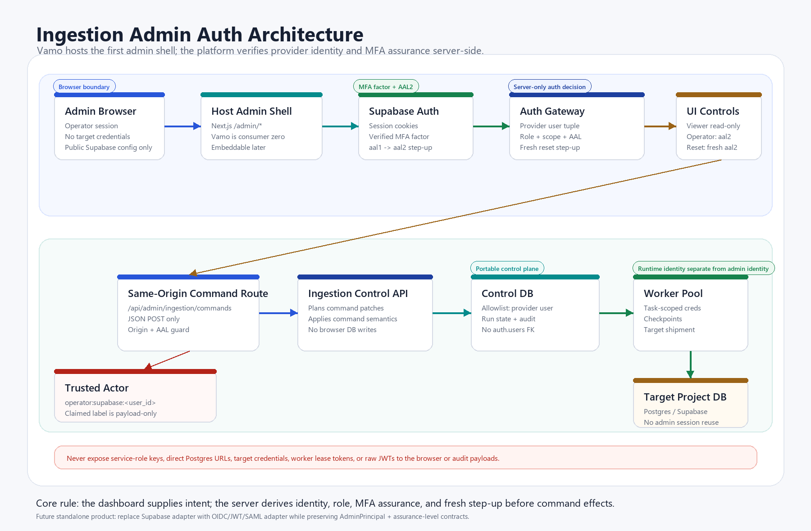
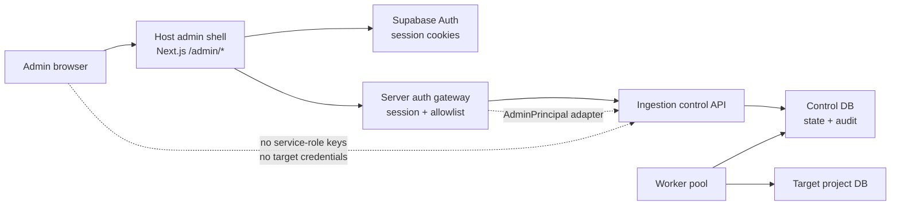

# Ingestion Admin Auth Architecture

Status: proposed for UI-01 implementation.

Companion diagram:



## Purpose

The ingestion platform needs operator controls that can be embedded inside any
host admin dashboard. Vamo is customer zero and the first host shell, but it is
not the identity boundary for the reusable platform.

This document defines the admin authentication and authorization model for the
operator console before the dashboard starts issuing live mutation commands.

## Decision

Use Supabase Auth as the first host identity provider, with a platform-owned
admin allowlist as the authorization source of truth.

Operators and admins must have at least one verified MFA factor. Destructive or
high-impact commands must be executed from an `aal2` session.

The command API must derive the trusted audit actor from the authenticated
Supabase session on the server. Browser-supplied actor labels remain optional
for display or forensic context only; they are never trusted as the actor.

Architecture decision: adapter/gateway. The host dashboard owns login and
session plumbing, while the ingestion platform consumes a small, verified
`AdminPrincipal` object from an auth adapter. This keeps the control API
portable to future hosts and identity providers.

## Scope

This architecture covers:

- Authenticated access to `/admin/ingestion`.
- MFA enrollment and step-up requirements for operator roles.
- Role-gated access to ingestion dashboard controls.
- Trusted actor derivation for `/api/admin/ingestion/commands`.
- Admin allowlist storage and revocation behavior.
- Secret boundaries between browser, host server, platform control DB, workers,
  and target projects.

It does not cover customer billing, organization management, SSO, passkeys, or
multi-tenant hosted-console packaging. Those can layer on the same adapter once
the embedded admin path is stable.

## Current State

Today the command route is intentionally hardened but still transitional:

- Browser calls use `INGESTION_ADMIN_API_TOKEN`.
- The route compares bearer tokens in constant time.
- The trusted audit actor is hardcoded as `api:admin-api`.
- A caller-supplied `actorId` is recorded only as `claimedActorId`.

That is acceptable for a private development boundary, but not for the operator
UI. UI-01 replaces this with session-derived identity and role checks.

## Trust Boundaries



Boundary rules:

- Browser code receives only public Supabase configuration such as
  `NEXT_PUBLIC_SUPABASE_URL` and `NEXT_PUBLIC_SUPABASE_ANON_KEY`.
- Supabase service-role keys, direct Postgres URLs, target credentials, and
  worker credentials are server-only.
- The admin dashboard never writes directly to the control DB or target DB.
- The ingestion platform accepts a verified admin principal, not a raw browser
  claim.
- Worker credentials are task-scoped and separate from admin session identity.

## Identity Model

P0 principal shape:

```ts
type AdminPrincipal = {
  provider: "supabase";
  userId: string;
  email: string;
  role: "viewer" | "operator" | "admin";
  scopes: string[];
  assuranceLevel: "aal1" | "aal2";
  hasVerifiedMfaFactor: boolean;
  stepUpSatisfiedAt?: string;
  sessionId?: string;
};
```

Role behavior:

| Role | Dashboard | Commands |
| --- | --- | --- |
| `viewer` | Read control-plane status and stats. | None. MFA encouraged but not required in P0. |
| `operator` | Read status and use operational controls. | Requires verified MFA factor; start, pause, shutdown, restart require `aal2` or step-up. |
| `admin` | Full operator actions plus reset and admin maintenance. | Requires verified MFA factor; reset requires reason and current `aal2`. |

The role and scopes come from the platform allowlist, not from
`user_metadata`/`raw_user_meta_data`. User-editable metadata is not an
authorization source.

## MFA Policy

Supabase Auth represents the session assurance level with the `aal` claim:

- `aal1`: conventional login only.
- `aal2`: login plus a verified second factor such as TOTP or phone OTP.

P0 policy:

- `viewer`: can read the dashboard at `aal1`, with an enrollment nudge.
- `operator`: must have at least one verified MFA factor and must step up to
  `aal2` before issuing mutation commands.
- `admin`: must have at least one verified MFA factor and must be `aal2` for
  all mutation commands.
- `reset`: always requires `admin`, a reason, and a fresh step-up challenge.

The dashboard should redirect users who can raise their assurance level to an
MFA challenge page instead of treating them as permanently forbidden. A user who
is allowlisted as `operator` or `admin` but has no verified factor should see an
MFA enrollment requirement before controls are enabled.

TOTP is the preferred first factor type because it is widely supported and does
not add SMS delivery cost or carrier risk. Phone MFA can be added later if
needed for operator convenience.

### Authenticator app compatibility

TOTP is an open standard (RFC 6238), so there is nothing app-specific to build or
integrate. A single Supabase MFA TOTP enrollment (an `otpauth://` QR plus a manual
secret) is read by any authenticator app — Google Authenticator, Microsoft
Authenticator, Authy, 1Password, Bitwarden, Apple Passwords, and others are
interchangeable. The enrollment screen presents the QR and the manual key and
names a few common apps rather than locking to one: we support the standard, the
operator picks the app.

### First-factor login vs. MFA (SSO note)

"Sign in with Google/Microsoft" is OAuth/OIDC **login** — the first factor
(`aal1`) — not MFA. Supabase supports Google and Azure (Microsoft) as OAuth
providers, mostly by configuration. The load-bearing interaction: an external
identity provider's own 2FA does **not** raise Supabase's AAL. A session that
logged in via Google is still `aal1` to Supabase, so a Supabase-enrolled factor
(TOTP) is still required to reach the `aal2` that mutation commands demand. SSO
replaces the password, not the second factor. For P0, magic-link login is
simplest; Google/Microsoft SSO is a later convenience, never a substitute for
enrolled MFA.

For destructive reset, `aal2` alone is not enough because the user may have
completed MFA hours earlier. The reset flow should force a fresh challenge and
accept it only within a short server-defined window, for example five minutes.

### Session Lifetime vs. Fresh Step-Up

The normal Supabase Auth session may be configured longer for operator comfort
(for example, in the host Supabase Auth JWT/session settings), because ordinary
dashboard reads and low-risk navigation should not force constant re-login.
That is separate from the **fresh step-up** window used for destructive or
high-impact actions such as reset and staging-canary approval.

For those actions, the platform keeps a short server-defined freshness window
and shows a countdown in the admin masthead. When the countdown expires, the
operator can keep the dashboard session but must refresh MFA before recording a
new destructive approval.

## Admin Allowlist

Use a platform-owned table as the P0 source of truth:

```sql
create table ingestion_admin_principals (
  provider text not null default 'supabase',
  provider_user_id text not null,
  email text not null,
  role text not null check (role in ('viewer', 'operator', 'admin')),
  scopes text[] not null default array['vamo'],
  mfa_required boolean not null default true,
  status text not null check (status in ('active', 'suspended')),
  created_at timestamptz not null default now(),
  created_by_provider text,
  created_by_provider_user_id text,
  expires_at timestamptz,
  last_seen_at timestamptz,
  primary key (provider, provider_user_id)
);
```

Do not foreign-key this table to `auth.users` unless the control database and
host Supabase Auth project are guaranteed to be the same project. The portable
platform model stores the externally verified identity tuple
`(provider, provider_user_id)` and matches it against the session principal
resolved by the host auth adapter.

Placement options:

- If the table lives in an exposed schema, enable RLS and grant only the exact
  roles needed.
- Prefer a private schema or server-only access for P0 because dashboard routes
  can resolve authorization server-side.
- Do not expose allowlist mutation to the browser in the first slice.

`app_metadata` can cache coarse role hints later, but the allowlist remains the
fresh authorization source. That avoids stale JWT role claims and makes
revocation immediate at command time.

## Request Flows

### Dashboard Read Flow

1. Operator opens `/admin/ingestion`.
2. Middleware refreshes Supabase SSR cookies and protects `/admin/*`.
3. Server component or route handler calls Supabase `getUser()` from the server
   client.
4. Server checks `ingestion_admin_principals`, verified MFA factors, and current
   session assurance level.
5. Non-authenticated users are sent to sign-in.
6. Authenticated but non-allowlisted users receive a 403 page.
7. Allowlisted operators/admins without a verified factor are sent to MFA
   enrollment.
8. Allowlisted users with a factor but only `aal1` are sent to MFA challenge
   before mutation controls are enabled.
9. Viewers can read status and stats; operators/admins see enabled controls only
   when the role and assurance checks pass.

### Command Flow

1. Dashboard sends a same-origin JSON POST to
   `/api/admin/ingestion/commands`.
2. Route handler resolves the Supabase user server-side with the current
   session cookies.
3. Route checks the allowlist row, role, scope, status, expiry, verified MFA
   factors, and current `aal`.
4. Route constructs the trusted actor:

   ```ts
   actor: {
     type: "operator",
     id: `supabase:${principal.userId}`
   }
   ```

5. Route passes the verified principal and command to the ingestion control API.
6. Control API applies command planning and persistence rules.
7. Audit rows store the trusted actor plus non-sensitive context:
   `email`, `role`, `scopes`, `assuranceLevel`, `projectKey`, command, scope,
   and reason.

The route must never store access tokens, refresh tokens, full cookies, or raw
JWTs in the audit payload.

### Worker Flow

Workers do not reuse admin sessions. They use worker or service credentials that
are issued for control-plane leases and shipment adapters.

Admin identity answers "who asked for this operation." Worker identity answers
"which runtime performed the work." Both should be visible in telemetry, but
they are different principals.

## CSRF And Browser Boundary

The command API is cookie-authenticated after UI-01, so it must also be
same-origin protected:

- No CORS for command routes.
- Require JSON requests.
- Reject unexpected `Origin` values for state-changing routes.
- Prefer `SameSite=Lax` or stricter cookies.
- Check `Sec-Fetch-Site` when available.
- Consider a CSRF token for destructive commands once the admin console is
  packaged as an embeddable widget across host domains.

Bearer-token command support can remain temporarily for non-browser scripts, but
it should move behind a separate machine-token route or feature flag. The
browser UI should not depend on it.

## Session And Revocation Rules

- Use the server-side Supabase client with cookies for App Router routes.
- Use `getUser()` on command routes instead of trusting a client-provided user
  object.
- Use Supabase MFA APIs to read the current assurance level and verified
  factors; do not infer MFA from user-editable metadata.
- Recheck the allowlist on every mutation command.
- Suspended or expired allowlist rows deny commands immediately.
- Reset commands require a reason and current `aal2`.
- Deleting a Supabase user is not enough to guarantee instant token invalidation;
  command-time allowlist checks are the revocation control.

## Secret Handling

| Secret or credential | Browser | Host server route | Worker |
| --- | --- | --- | --- |
| Supabase public URL / anon key | Allowed | Allowed | Usually not needed |
| Supabase service-role key | Forbidden | Server-only if required | Server-only if required |
| `INGESTION_CONTROL_DATABASE_URL` | Forbidden | Allowed | Allowed if task-scoped |
| Target DB credentials | Forbidden | Usually forbidden | Allowed by shipment adapter |
| Worker lease token | Forbidden | Usually forbidden | Allowed |
| Admin session cookies | Browser cookie only | Read via server auth client | Forbidden |

Any env var prefixed with `NEXT_PUBLIC_` is browser-exposed. Never place
service-role keys, target credentials, or direct control DB URLs behind that
prefix.

## Implementation Slices

### UI-01.0 - Dependency And Env Alignment

- Recheck current Supabase SSR docs and changelog immediately before coding.
- Add the current SSR package expected by the docs, likely `@supabase/ssr`.
- Align env examples with the site code:
  `NEXT_PUBLIC_SUPABASE_URL` and `NEXT_PUBLIC_SUPABASE_ANON_KEY`.

### UI-01.1 - Server Auth Helpers

- Add server, browser, and middleware Supabase clients.
- Extend middleware from `/j/*` only to also cover `/admin/:path*` and auth
  callback routes.
- Add sign-in, callback, and sign-out routes/pages.

### UI-01.2 - Admin Allowlist

- Add `ingestion_admin_principals` migration in the control-plane database.
- Add a pure role/scope policy module with unit tests.
- Add a server-only repository for principal lookup.
- Store provider identity as `(provider, provider_user_id)` without an
  `auth.users` foreign key, so the control plane can be separated from the host
  Supabase Auth project.

### UI-01.3 - MFA Enrollment And Step-Up

- Add TOTP enrollment and challenge screens for allowlisted operators/admins.
- Add an auth helper that reads current `aal` and verified factor status.
- Redirect users who can satisfy MFA to challenge/enrollment instead of a hard
  403.
- Add tests for `viewer` read-only at `aal1`, operator command rejection at
  `aal1`, and reset requiring `aal2`.

### UI-01.4 - Protect Read Endpoints

- Gate `/admin/ingestion` and ingestion read endpoints by allowlist.
- Render read-only controls for `viewer`.
- Render 403 for authenticated users who are not active principals.

### UI-01.5 - Replace Browser Bearer Commands

- Replace UI command calls with session-authenticated same-origin POSTs.
- Derive audit actor from `AdminPrincipal`.
- Preserve machine-token support separately if scripts still need it.

### UI-01.6 - Role-Aware Controls

- Enable start/pause/shutdown for `operator` and `admin`.
- Enable reset only for `admin` after a fresh step-up challenge.
- Surface applied/skipped/errors from the command API with the UI-00 `ok`
  semantics.

## Validation Matrix

| Case | Expected result |
| --- | --- |
| Anonymous user opens `/admin/ingestion` | Redirect to sign-in. |
| Authenticated user without allowlist row | 403, no control API call. |
| `viewer` opens dashboard | Status visible, mutation controls disabled. |
| `operator` without verified MFA factor opens dashboard | Redirect to MFA enrollment; mutation controls disabled. |
| `operator` with factor but `aal1` tries command | Redirect/challenge for MFA; no command applies. |
| `operator` starts target in scope at `aal2` | Command applies, audit actor is `operator:supabase:<user_id>`. |
| `operator` resets target | 403 or command rejection. |
| `admin` resets target at `aal1` | Rejected with step-up required. |
| `admin` resets target at old `aal2` with reason | Rejected with fresh step-up required. |
| `admin` resets target after fresh step-up with reason | Command applies and audit includes `assuranceLevel: aal2`. |
| Suspended allowlist row | 403 even with valid Supabase session. |
| Expired allowlist row | 403 and optional audit/security event. |
| Forged `actorId` in request body | Ignored for trusted actor; optional payload breadcrumb only. |
| Missing `Origin` or cross-origin POST | Rejected for browser command route. |
| Service-role key accidentally prefixed `NEXT_PUBLIC_` | Secret scan or env validation fails. |

## Open Decisions

- Whether P0 uses a private control schema table only, or an RLS-protected table
  in an exposed schema for admin readback.
- Whether `viewer` should also require MFA before reading stats, or whether
  read-only at `aal1` is acceptable for the first operator rollout.
- Whether machine-token command support remains in the same route with explicit
  mode detection or moves to `/api/admin/ingestion/machine-commands`.
- Whether the standalone platform ships a Supabase adapter first and generic
  OIDC/JWT adapters second, or defines the generic adapter before extraction.
- Whether to offer Google/Microsoft SSO login as a first-factor convenience, and
  when — deferred past the P0 gate, and never in place of enrolled MFA for `aal2`.

## References

- Supabase SSR client docs:
  https://supabase.com/docs/guides/auth/server-side/creating-a-client
- Supabase MFA docs:
  https://supabase.com/docs/guides/auth/auth-mfa
- Supabase TOTP MFA docs:
  https://supabase.com/docs/guides/auth/auth-mfa/totp
- Supabase user management docs:
  https://supabase.com/docs/guides/auth/managing-user-data
- Supabase API security docs:
  https://supabase.com/docs/guides/api/securing-your-api
- Supabase RLS docs:
  https://supabase.com/docs/guides/database/postgres/row-level-security
- Supabase changelog:
  https://supabase.com/changelog
