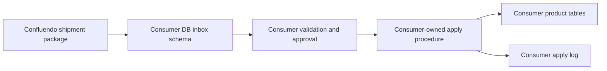
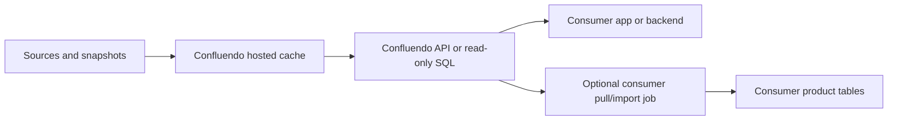

# Data Delivery Architecture

Status: architecture decision for Confluendo delivery modes.

Confluendo does not ship consumer data by backup/restore, physical log
shipping, or generic replication as its default product path. Those are
database operations. Confluendo ships governed product records.

The chosen delivery models are:

1. **Consumer inbox schema** for production-grade customer database delivery.
2. **Hosted Confluendo DB/API** for customers that do not want to expose target
   database write credentials.

Vamo is customer zero. The Vamo implementation should prove these delivery
contracts without making Vamo the platform boundary.

## Decision Summary

Use a shipment package as the durable unit of delivery.

Each shipment package contains:

- package id,
- consumer id and target environment,
- source snapshot ids and source versions,
- policy and license manifest,
- attribution manifest,
- schema contract version,
- row counts,
- per-row idempotency keys,
- checksums,
- diff summary,
- approval id,
- rollback or reversal plan.

The package can then be delivered either into a consumer-owned inbox schema or
served from Confluendo's hosted control/cache database.

## Why Not Backup/Restore Or Log Shipping

Backup/restore is too broad:

- restores whole databases or large database slices,
- is difficult to scope to a reviewed product-cache shipment,
- can overwrite unrelated consumer state,
- is awkward for incremental attribution, policy, and rollback records.

Physical log shipping is the wrong abstraction:

- it replicates database mutation logs, not curated product records,
- it couples Confluendo to the consumer's storage internals,
- it does not naturally express policy blocks, license attribution, promotion
  review, or row-level shipment approval.

Generic replication/CDC can become a later enterprise adapter, but it is not
the default SME product path.

## Mode A - Consumer Inbox Schema

Consumer inbox schema is the preferred production-grade delivery path.

Confluendo writes only into an isolated schema owned by the consumer database,
for example:

```text
confluendo_inbox.shipments
confluendo_inbox.shipment_items
confluendo_inbox.place_canonicals_stage
confluendo_inbox.location_source_refs_stage
confluendo_inbox.apply_log
```

The consumer owns the final apply step from inbox rows into product tables.
That final step can be a stored procedure, scheduled job, admin action, or
consumer-side worker.



### Responsibilities

Confluendo owns:

- package creation,
- source/license/attribution manifest,
- package checksum,
- inbox write,
- delivery status,
- retry and resume of inbox delivery,
- Confluendo-side audit trail.

Consumer owns:

- final product schema,
- inbox schema migration approval,
- apply procedure,
- production promotion decision,
- product-table RLS and constraints,
- production rollback authority.

### Required DB Account

The consumer provides a least-privilege DB role for Confluendo.

That role can:

- connect to the target database,
- use `confluendo_inbox`,
- insert into inbox stage tables,
- update Confluendo-owned delivery status rows where needed,
- select only what is needed for idempotency and delivery verification.

That role cannot:

- write directly to consumer product tables,
- delete product records,
- bypass RLS,
- own tables,
- alter schemas,
- create roles,
- read unrelated consumer tables.

### Production Apply Contract

The consumer-owned apply step must be idempotent and auditable.

Minimum contract:

```text
apply_confluendo_shipment(package_id, approved_by, approval_reason)
```

It should:

- verify package checksum,
- verify schema contract version,
- verify package is approved for the environment,
- upsert into product tables,
- record per-row results,
- reject unknown deletes by default,
- mark the package applied exactly once,
- keep a rollback or reversal record.

For Supabase/Postgres targets, product tables in exposed schemas still require
RLS. The inbox schema should not be exposed to browser clients.

## Mode B - Hosted Confluendo DB/API

Hosted Confluendo DB/API is the preferred low-friction path for customers that
do not want to give Confluendo any target DB write account.

Confluendo hosts the promoted cache and exposes it through:

- read-only API,
- read-only SQL role,
- signed export endpoint,
- SDK/client adapter,
- optional webhook for changed packages.



### Responsibilities

Confluendo owns:

- hosting,
- ingestion,
- policy gates,
- cache freshness,
- attribution manifests,
- API uptime,
- audit and usage logs,
- customer/project access control.

Consumer owns:

- deciding whether to read live from Confluendo,
- deciding whether to cache/persist locally,
- product-side display and behavior,
- any local import job into its own database.

### Access Model

Hosted access should be project-scoped.

Default grants:

- read-only API token or OAuth client,
- project/tenant-scoped queries,
- rate limits,
- usage telemetry,
- attribution response fields,
- freshness headers or fields,
- package/version identifiers.

No hosted API response should require the consumer to understand Confluendo's
internal staging or worker tables.

## Vamo Customer-Zero Path

Vamo staging canary remains a staging-only safety proof. It uses
`vamo_canary_app` to write a tiny bounded set of rows directly into Vamo staging
because the goal is to prove the target adapter end-to-end.

Vamo production should not reuse `vamo_canary_app`.

For Vamo production, the preferred next slice is **consumer inbox schema**:

```text
Confluendo package
  -> Vamo production confluendo_inbox schema
  -> Vamo-owned apply function
  -> public.location_canonicals / public.location_source_refs
```

This keeps Confluendo from having direct production write access to final Vamo
product tables while still letting Confluendo deliver governed data packages.

IP-17 implements the first version of this path:

- package creation and approval policy live in Confluendo platform core,
- delivery writes only to `confluendo_inbox.shipments` and
  `confluendo_inbox.shipment_items`,
- payload and package checksums are computed inside Vamo Postgres with
  `extensions.digest(...)`,
- the dashboard records approval only; live delivery remains CLI-gated,
- Vamo owns `confluendo_inbox.apply_confluendo_shipment(...)` and the final
  product-table mutation.

Vamo can also use the hosted Confluendo API for preview, admin comparison,
search assistance, or fallback reads where product latency and availability
requirements allow it.

## Environment Policy

Staging:

- Confluendo may use direct bounded canary roles for tiny proof writes.
- Canary roles must be narrow and environment-specific.
- Sentinel/proof artifacts are staging-only.

Production:

- Confluendo does not use staging canary roles.
- Preferred write path is consumer inbox schema.
- Direct product-table writes require a separate production-shipment slice and
  explicit approval; they are not part of IP-16.
- Hosted Confluendo API remains read-only from the consumer point of view.

## Shipment State Model

Recommended package states:

```text
planned
dry_run
review_required
approved_for_staging
staging_delivered
staging_verified
approved_for_production_inbox
production_inbox_delivered
consumer_apply_pending
consumer_applied
consumer_rejected
rolled_back
failed
```

The state machine must not jump from `dry_run` to production. Staging evidence
and explicit approval are required before production delivery.

## Minimal Consumer Inbox Tables

Suggested initial schema:

```sql
create schema if not exists confluendo_inbox;

create table confluendo_inbox.shipments (
  package_id text primary key,
  consumer_key text not null,
  target_environment text not null check (target_environment in ('staging', 'production')),
  schema_contract text not null,
  status text not null,
  checksum text not null,
  source_manifest jsonb not null,
  attribution_manifest jsonb not null,
  diff_summary jsonb not null,
  approved_by text,
  approval_reason text,
  delivered_at timestamptz not null default now(),
  applied_at timestamptz
);

create table confluendo_inbox.shipment_items (
  package_id text not null references confluendo_inbox.shipments(package_id),
  item_key text not null,
  target_table text not null,
  operation text not null check (operation in ('upsert', 'delete')),
  payload jsonb not null,
  payload_checksum text not null,
  apply_status text not null default 'pending',
  apply_error text,
  primary key (package_id, item_key)
);
```

Product-specific stage tables can be added where typed columns are better than
generic JSONB. The generic item table is useful for audit and disaster recovery.

## Open Follow-Ups

- Promote the Vamo production inbox schema migrations through staging and
  production under the migration promotion policy.
- Run the first live, confirmation-gated production inbox delivery after
  approval and production safety checks.
- Add Confluendo control-plane package signing on top of checksum verification.
- Add richer dashboard states for consumer-applied package details and Vamo
  apply failures.
- Add hosted API read model and project-scoped access tokens.
- Decide whether hosted Confluendo API should have SDK-first or REST-first
  packaging.

## Architecture Decision

Use **consumer inbox schema** for governed production shipment into customer
databases and **hosted Confluendo DB/API** for no-credential customer access.

Backup/restore, log shipping, and raw replication are not the default product
paths. They can be future enterprise adapters, but they do not replace shipment
packages, approval gates, attribution manifests, and per-row delivery ledgers.
