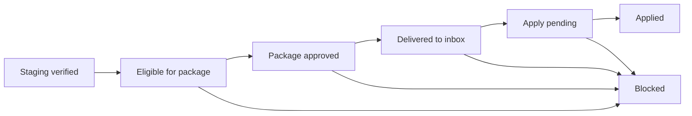

# IP-18.8.6 Draft - Delivery Page Inline Operator Manual

Status: **APPROVED for implementation**.

Repo: `Z:\vamo-ip17`. From current `main`:

```powershell
git switch main
git pull --ff-only origin main
git switch -c feature/ip18.8.6-delivery-workflow-guide
```

Non-goals, hard:

- No DB schema changes.
- No auth, policy, delivery adapter, consumer-apply function, telemetry, or
  route changes.
- Presenter helper + thin React component only.
- Reuse existing delivery snapshot data; no new DB calls.
- No background-job system.

Validation:

```powershell
npm --workspace @confluendo/console run build
npm --workspace @confluendo/ingestion-platform test # if a pure presenter helper is added
npm --workspace @confluendo/ingestion-platform run ip15:boundary-audit
git diff --check
```

Acceptance:

- All seven state labels are present.
- Partial-apply/non-atomic recovery copy is present.
- `Delivered — apply state unknown` state is present.
- Empty approval-envelope copy is explicit.
- No raw `canary` in operator copy.
- Dark-mode selectors cover the guide.

Commit: `docs+feat(ip-18.8.6): add Delivery tab inline operator workflow guide`

Open a draft PR after validation.

Purpose: add an inline manual to the Confluendo ingestion console Delivery tab
so operators understand the package lifecycle, prerequisites, state labels, and
next action without reading runbooks or interpreting raw status names.

This draft is written for Vamo customer zero, but the structure should remain
usable for other consumers once their display contract supplies labels and
state explanations.

## Placement On The Delivery Tab

Place the manual near the top of the Delivery tab, directly below the page
heading and before the production package approval controls.

Recommended layout:

1. A compact always-visible workflow strip showing the current package path.
2. A short "What this page does" paragraph.
3. A terminology table for the visible package states.
4. A collapsible "Prerequisites and safeguards" section.
5. A collapsible "What to do next" section that reacts to the current page
   data where possible.

Raw package ids, wave keys, audit ids, and run keys should stay in secondary
details. They are evidence, not the primary operator workflow.

Universal safety principle:

> When a package's real state is unclear, refresh delivery telemetry first. It
> reads the actual consumer inbox, does not change product data, and is safe to
> run before retrying approval, delivery, or apply.

## Operator-Facing Page Introduction

Suggested copy:

> Delivery moves staging-verified data into the consumer inbox, then applies it
> through the consumer-owned apply function. For Vamo, Confluendo can deliver
> packages to the Vamo production inbox, but Vamo still controls when those
> packages are applied to product tables.

Short version for a compact info panel:

> Use this page to approve, deliver, and apply production packages. Each package
> starts from staging-verified data, lands in the consumer inbox, then waits for
> the consumer-owned apply step.

## Workflow Diagram

Use an inline diagram above the state table. Keep the labels operator-friendly.
The UI can render this as a horizontal stepper; the Mermaid diagram below is
the review/source version.



Preferred UI labels:

- Staging verified
- Eligible for package
- Package approved
- Delivered to inbox
- Apply pending
- Applied
- Blocked

Avoid operator-facing labels such as `canary`, `consumer_apply_pending`, or
`production_package_delivered` unless they appear in a technical details drawer.

## State Terminology

| State shown in UI | Meaning | Why it matters | Operator action |
| --- | --- | --- | --- |
| **Staging verified** | The scope was written successfully to the consumer staging target and has valid staging evidence. | This is the proof Confluendo needs before a production package can be prepared. | No production action yet. Use it as the source pool for package eligibility. |
| **Eligible for package** | The scope passed dry-run and staging verification, has valid evidence, and can be included in a production package approval. | This is the pool of work that can move forward. | Select one or more eligible scopes, review the approval envelope, enter an audit reason, and request package approval. |
| **Package approved** | An operator approved a bounded production package wave, but delivery to the consumer inbox has not happened yet. Approvals expire after about 15 minutes. | This is a short-lived delivery window, not a completed delivery. | Deliver promptly with the confirmation-gated delivery command. If the approval expires, create a fresh approval. |
| **Delivered to inbox** | Confluendo delivered the package to the consumer production inbox. Product tables have not necessarily changed yet. | Delivery and apply are separate safety boundaries. | If the package is not yet applied, run or click the Apply to Vamo control after checking preflight. |
| **Apply pending** | The package is in the consumer inbox and has pending apply items. | The package is ready for the consumer-owned apply step. | Run apply preflight, confirm target tables/items, enter an audit reason, and apply to Vamo. |
| **Delivered — apply state unknown** | The package is delivered, but telemetry is unavailable or has not confirmed whether apply is pending, applied, or failed. | The UI must not claim a pending/apply state it cannot prove. | Refresh delivery telemetry before retrying, applying, or escalating. |
| **Applied** | The consumer apply function completed successfully. For Vamo, the package data is now in the Vamo product tables. | This package is done and should not be re-delivered. A completed package should not be re-applied for no reason. | No action needed. Use it as evidence for ramp confidence and move to the next eligible package. |
| **Blocked** | A guard stopped the package or one of its items. Common reasons include stale evidence, checksum drift, target incompatibility, expired approval, failed apply, partial-batch apply failure, or a policy limit. | Blocked work needs investigation before retry. | Open details, read the blocker reason, fix the upstream issue, refresh telemetry, then create a fresh approval or rerun the appropriate gated step. |

## Prerequisites

### Before A Scope Can Be Eligible For Package

All of these must be true:

- The scope has completed dry-run successfully.
- The dry-run wrote nothing to the target.
- The scope completed staging verification successfully.
- The staging evidence still matches the package content.
- The target schema contract is compatible.
- The source rights allow durable fact storage and package delivery.
- No active blockers remain on the queue item.
- The scope has not already been delivered in an active or spent package.

Operator wording:

> A scope becomes eligible only after Confluendo proves the data in dry-run and
> staging verification. If a scope is missing here, check the Staging tab first.

### Before Delivery To Inbox

All of these must be true:

- A production package wave was approved.
- The approval has not expired. Production package approvals are intentionally
  short-lived, about 15 minutes; deliver promptly or re-approve.
- The package content still matches the staged content hash.
- Delivery is run through the confirmation-gated production inbox path.
- The production inbox environment is explicitly `production`.
- The inbox adapter confirms checksum authority in consumer Postgres.

Operator wording:

> Delivery puts the package into the consumer inbox only. It does not apply data
> to product tables.

### Before Apply To Vamo

All of these must be true:

- The package is delivered to the Vamo production inbox.
- Apply preflight can read the package and its items.
- At least one package item is still pending.
- The operator has admin access, AAL2, and fresh MFA when required.
- The operator provides an audit reason.
- Apply runs through the consumer's own least-privilege apply function.

Operator wording:

> Apply is the consumer-owned step. For Vamo, this calls Vamo's approved inbox
> apply function and writes to Vamo product tables only through that function.

Credential detail for the Technical Evidence drawer:

- Delivery uses the production inbox writer credential.
- Telemetry uses the read-only inbox telemetry credential.
- Apply uses the dedicated consumer apply credential.
- The apply credential is separate from both writer and telemetry credentials.

## Recommended Inline Help Content

### Section: What This Page Controls

Suggested copy:

> This page controls production package waves. A package wave groups one or more
> staging-verified scopes, delivers them to the consumer inbox, and then lets the
> consumer apply them. Confluendo owns package preparation and inbox delivery.
> The consumer owns product-table apply.

### Section: Current Batch Status

Suggested copy:

> The latest delivery batch shows the most recent package wave and its current
> consumer state. If the latest batch is Applied, it is complete. If it is Apply
> pending, run preflight and apply it. If it is Blocked, open details before
> retrying. If telemetry is unavailable, show Delivered — apply state unknown and
> refresh telemetry before taking another action.

Display guidance:

- Show a prominent status card, not a log sentence.
- Put the state label first, for example `Latest batch: Apply pending`.
- Show package count, target environment, approval audit, delivery audit, and
  telemetry source as secondary facts.
- Put the wave key in a collapsible technical details section.

### Section: Approval Envelope

Suggested copy:

> The approval envelope is derived from the selected scopes. It tells the server
> how many scopes, packages, and target writes the operator is approving. If
> nothing is selected, no approval caps are sent.

Operator clarification:

> Expected target writes are the staging-proven target writes for the selected
> scopes. They are not the projected internet-scale volume for a future source
> crawl.

Display guidance:

- Do not show `0 unit(s) / 0 package(s) / 0 writes` as if it were an action.
- Empty state copy: `Select eligible scopes to preview the approval envelope.`
- When selected, show:
  - Selected scopes
  - Expected packages
  - Expected target writes
  - Server cap or policy cap, if lower than selection

### Section: Apply Preflight

Suggested copy:

> Preflight checks the package before apply. It confirms shipment status,
> checksum, target tables, item count, and pending/applied item states. Preflight
> does not change product data.

Display guidance:

- Keep preflight results visible while apply is running.
- If preflight fails, show the failed check and the package id in technical
  details.
- Avoid the generic phrase `preflight_failed` without explanation.

### Section: Long Running Operations

Suggested copy:

> Applying multiple packages can take time. While apply is running, do not
> refresh or retry from another tab. The page will refresh delivery telemetry
> when the request completes.

Partial-batch apply copy:

> Batch apply is sequential, not atomic. If package 3 fails in a 5-package batch,
> packages 1-2 may already be applied, package 3 is failed, and packages 4-5 were
> not attempted. After fixing the failed package, re-run apply. Re-running apply
> is safe because the apply function skips packages that are already applied.

Display guidance:

- Button states should say what is happening:
  - `Checking apply preflight...`
  - `Applying 10 packages to Vamo...`
  - `Refreshing delivery status...`
- Show elapsed time after a few seconds.
- Preserve the audit reason while operations run.
- If the browser times out, show an ambiguous outcome message and ask the
  operator to refresh telemetry before retrying.
- If a batch partially fails, show applied, failed, and not-attempted package
  counts separately.
- Do not tell the operator to re-deliver after partial apply failure. The
  recovery path is refresh telemetry, fix the failed package, then re-run apply.

## Per-State User Flow

### Eligible For Package

Operator sees:

- A selectable row in the delivery queue.
- Expected target writes.
- Target compatibility.
- Staging evidence available.

Operator does:

1. Select one or more eligible scopes.
2. Confirm the derived envelope.
3. Enter an audit reason.
4. Request package approval.

Audit reason examples:

- `Approve production package wave for staging-verified Vamo scopes after successful dry-run and staging evidence review.`
- `Approve bounded production inbox package wave for selected staging-verified Vamo scopes.`

### Delivered To Inbox

Operator sees:

- A delivered package or wave.
- Delivery audit id.
- Package ids and checksums in details.
- Consumer apply status is pending or unknown.

Operator does:

1. Run apply preflight.
2. Confirm pending items and target tables.
3. Apply to Vamo if preflight passes.
4. If the apply state is unknown, refresh telemetry before applying.

### Apply Pending

Operator sees:

- Delivered package in consumer inbox.
- Pending items.
- Apply control enabled when fresh MFA and audit reason requirements are met.

Operator does:

1. Enter an audit reason.
2. Apply the selected package(s) to Vamo.
3. Wait for telemetry refresh.
4. If a batch partially fails, fix the failed package and re-run apply. Already
   applied packages are skipped.

Audit reason example:

- `Apply delivered production inbox package wave to Vamo after successful preflight and bounded delivery verification.`

### Applied

Operator sees:

- Consumer apply completed.
- Applied package count.
- Apply audit ids.
- Product apply telemetry from the inbox.

Operator does:

1. Do not re-deliver.
2. Do not re-apply a completed package without a recovery reason.
3. In a partial-batch recovery, it is safe to re-run apply for the batch because
   completed packages are skipped.
4. Continue to the next eligible package wave or review ramp evidence.

### Blocked

Operator sees:

- Blocked state with reason.
- The affected scope/package.
- The failed stage: approval, delivery, preflight, or apply.

Operator does:

1. Open blocker details.
2. Identify whether the fix belongs in source data, staging evidence, package
   content, target schema, credentials, or policy.
3. If the blocked state came from batch apply, check whether the batch is
   partially applied. Do not re-deliver applied packages.
4. Fix the upstream issue.
5. Refresh telemetry.
6. Create a fresh approval if needed, or re-run apply when the package remains
   delivered and not fully applied.

Blocked copy examples:

- `Approval expired. Create a fresh package approval before delivery.`
- `Content drift detected. Re-run staging verification before packaging again.`
- `Apply failed in the consumer function. Review Vamo apply logs before retry.`
- `Batch apply stopped after package 3. Packages 1-2 were applied; packages 4-5 were not attempted. Fix package 3, then re-run apply.`
- `Policy cap exceeded. Reduce selection or request an approved ramp change.`

## Visual And Interaction Requirements

- Use a state stepper or compact flow card, not raw logs.
- Keep the current state visually dominant.
- Use one primary action per state.
- Use disabled button reasons inline, close to the button.
- Use dark-mode-safe text colors for all help panels, result panels, details,
  code, warnings, and empty states.
- Do not hide important workflow messages in small paragraph text.
- Do not display raw enum values as primary labels.
- Do not call staging verification `canary` in operator-facing copy.
- Keep raw ids copyable but secondary.
- Prefer `scope`, `package`, `inbox`, `apply`, and `consumer` over internal
  implementation terms.
- When telemetry is unavailable, do not show Apply pending unless pending items
  are known. Use Delivered — apply state unknown.

## Technical Details Drawer

Suggested drawer label:

> Technical evidence

Include:

- wave key
- package ids
- approval audit id
- delivery audit id
- apply audit ids
- telemetry source
- checksum
- raw status enum
- unit keys
- credential class used by the action, when relevant: delivery writer,
  read-only telemetry, or consumer apply

Do not include these in the primary status sentence unless the operator needs
them to complete an action.

## Implementation Notes For The Future Slice

This document should become a Delivery tab component, tentatively:

```text
web/apps/confluendo-console/app/admin/ingestion/delivery-workflow-guide.tsx
```

Recommended shape:

- Pure presenter helper for state labels and descriptions.
- Thin React component for layout and disclosure states.
- Reuse existing delivery snapshot data; do not add database calls.
- No changes to approval, delivery, apply, auth, policy, or telemetry logic.
- Add artifact tests for:
  - no raw `canary` wording in the Delivery guide;
  - all five requested state labels are present;
  - `Package approved`, `Staging verified`, and telemetry-unknown labels are
    present;
  - partial-batch/non-atomic apply recovery copy is present;
  - empty approval envelope copy remains explicit;
  - dark-mode selectors cover the guide and state table.

Possible component props:

```ts
type DeliveryWorkflowGuideProps = {
  latestWaveStatus?: string | null;
  consumerApplyStatus?: string | null;
  eligibleCount: number;
  deliveredCount: number;
  applyPendingCount: number;
  appliedCount: number;
  blockedCount: number;
};
```

## Open Review Questions

Resolved recommendations for implementation:

1. Keep the workflow strip always visible. Make the detailed terminology table
   collapsible after the first successful apply.
2. Use `Vamo inbox` in Vamo-specific UI. Keep `consumer inbox` in generic
   platform docs and component internals.
3. Show `Apply pending` only when pending apply items are known. If telemetry is
   unavailable after delivery, show `Delivered — apply state unknown`.
4. Separate blocked package rows into an Investigation panel so blocked work
   does not compete visually with actionable eligible/delivered work.
5. Show an explicit `No pending delivery work` state when all packages are
   Applied or Blocked.

Open wording question:

1. Should the terminal state say `No pending delivery work`, `Delivery is
   complete for now`, or both?
