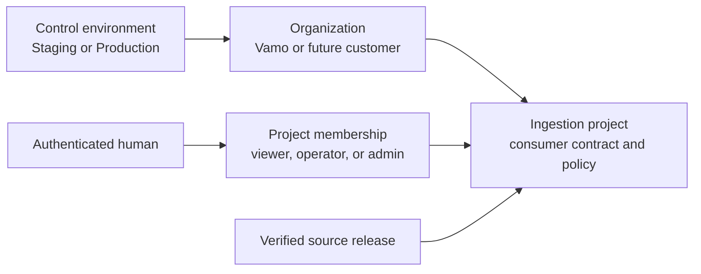

# Post-Vamo Platformization Plan

Status: proposed architecture direction for post-Vamo review. This document records hard platform
limits that do not block the Vamo release, but must be implemented before
Confluendo onboards a second customer or presents itself as a multi-source
hosted product.

## Decision

Vamo is customer zero, not the tenancy, authorization, or source boundary for
Confluendo. The current Vamo control path remains deliberately narrow while it
is proven. After the Vamo release, Confluendo must gain two platform
capabilities together:

1. project-scoped memberships for multiple customers, projects, and operators;
2. a governed source portfolio so no single provider is mistaken for the
   platform's data strategy.

Neither capability authorizes a new source or customer by itself. Every source
release and every consumer shipment retains its existing policy, evidence,
approval, and target-contract gates.

## Terms That Must Stay Separate

| Term | Meaning | Example |
| --- | --- | --- |
| Control environment | Operational infrastructure boundary. | Staging, Production |
| Organization | Customer or operating account that owns one or more projects. | Vamo, a future customer |
| Project | A governed ingestion and consumer-delivery boundary. | Vamo place intelligence |
| Membership | A human's role on one exact project. | Dana is admin for Vamo, viewer for Customer B |
| Source | A provider or dataset family with declared rights and policy. | FSQ OS Places, Wikidata |
| Source release | One immutable, verified acquisition from a source. | A reviewed coordinate snapshot |

The workspace selector chooses an environment only. It must never imply a
customer/project choice, grant project access, or choose a source.



## Hard Limitation: Current Authorization Is Vamo-Era Only

`ingestion_platform.ingestion_admin_principals` currently stores one role and
an array of project scopes on each authenticated principal. It is safe enough
for the first Vamo deployment:

- multiple people can be provisioned as `viewer`, `operator`, or `admin`;
- a principal can be limited to `scopes = array['vamo']`;
- server-side authorization checks the requested project key before allowing an
  action.

It is not sufficient multi-customer authorization because one principal has one
role across every scope. It cannot safely express different roles for different
projects, for example:

```text
Dana      admin     Vamo
Dana      viewer    Customer B
Operator  operator  Vamo
Operator  admin     Customer C
```

It also has no explicit organization/customer model. Treating `scopes` as the
long-term tenant model would make revocation, delegated administration, audit,
and the console project picker ambiguous.

### Hard Release Boundary

The current model is acceptable only for the Vamo release and its explicitly
scoped operators. It is a hard platform limitation:

- do not onboard a second customer by merely adding another key to `scopes`;
- do not use `scopes = array['*']` as a platform-owner shortcut;
- do not expose a multi-customer project picker until membership authorization
  is authoritative on every server read and mutation;
- do not infer project identity from a browser-provided label, target name, or
  environment selection.

Creating a Staging Auth account and assigning it the current `vamo` scope is
still correct for Vamo testing. It grants that account only the Vamo project; it
does not claim that the account is a global Confluendo administrator.

## Post-Vamo Implementation Plan: Project Memberships

### PM-1: Model Organizations, Projects, And Memberships

Add the following control-plane model through normal staging-then-production
migration promotion:

| Object | Responsibility |
| --- | --- |
| `ingestion_organizations` | Customer/operating-account identity and status. |
| `ingestion_projects.organization_id` | Explicit parent ownership for each project. |
| `ingestion_project_memberships` | One principal plus one project plus one role/status record. |
| `ingestion_platform_owners` | Narrow, separately audited platform-management authority. |

`ingestion_project_memberships` must have a unique identity/project pair and
record `role`, `status`, `expires_at`, grant/revoke audit fields, and the
granting actor. Valid project roles remain `viewer`, `operator`, and `admin`.
A platform owner is not an implicit project administrator; it is a separate
capability used only for organization/project/membership administration.

### PM-2: Migrate Without Broadening Access

1. Backfill one membership for every existing `(principal, scope)` pair.
2. Run authorization in dual-read comparison mode: current scope decision and
   membership decision must agree before membership becomes authoritative.
3. Emit a safe discrepancy audit/event and fail closed on a mismatch for a
   mutation.
4. Make memberships authoritative after staging and production evidence is
   clean.
5. Remove `role` and `scopes` from runtime authorization only after a named
   migration-completion checkpoint. Historical audit rows retain their original
   fields.

No migration may turn a current Vamo account into access to another project.

### PM-3: Make Core Authorization Project-Scoped

Replace the array-scope check in the server auth adapter with an exact
membership lookup for `(provider, provider_user_id, project_key)`. The
`AdminPrincipal` supplied to policies must carry the selected project
membership role and organization/project identity.

Required tests:

- a Vamo admin cannot read or mutate Customer B;
- the same person can be Vamo admin and Customer B viewer;
- a suspended or expired membership fails closed even when another membership
  for the same person remains active;
- project selection tampering in browser requests cannot cross a membership
  boundary;
- all existing Vamo authorization and MFA/step-up checks remain intact.

### PM-4: Give The Console A Project Context

After sign-in, the console resolves memberships server-side for the selected
environment. An operator can select only a project for which an active
membership exists. The UI order is fixed:

```text
Environment -> sign-in -> permitted project -> project workflow
```

The selected project is an untrusted navigation hint only. Every dashboard
read, route, worker request, policy evaluation, and audit write re-resolves the
active membership on the server. The current environment selector remains an
environment selector; it is not repurposed as a customer selector.

### PM-5: Manage Access Through The Console

Add a platform-owner-only access-management area after PM-1 through PM-4 are
proven. It must support invitation/provisioning requests, project-role grants,
suspension, expiry, and immutable audit evidence. It must not expose direct
control-table update forms to ordinary project admins.

### Completion Gate

Confluendo may onboard a second customer only after PM-1 through PM-5 are
implemented, migration-promoted to control staging and production, and proven
with cross-project negative tests. Vamo work can continue before that gate.

## Source Portfolio: Confluendo Is Not An FSQ Wrapper

The architecture already names a source portfolio: open snapshots, APIs, SQL
sources, manual imports, internal observations, and AI-assisted normalization.
It explicitly identifies FSQ OS Places, GeoNames, and Wikidata/Wikimedia as
possible place-data inputs. The current implementation, however, has
commissioned only the FSQ acquisition path. That is a Vamo-first delivery
choice, not a product decision that FSQ is the sole source.

### Current State

| Capability | Status |
| --- | --- |
| Provider-neutral source contracts and local snapshot adapter | Implemented |
| Immutable source release registry and artifact verification | Implemented |
| Source rights, attribution, retention, and media policy gates | Implemented |
| Live FSQ acquisition/commissioning path | Implemented for bounded releases |
| GeoNames, Wikidata, Wikimedia, official geographic, or customer source commissioning | Not yet implemented |
| Cross-source canonical matching and conflict policy | Architecture intent only; not yet a commissioned path |

### Source Families To Support

| Family | Intended contribution | Guardrail |
| --- | --- | --- |
| Place datasets | Names, categories, coordinates, source IDs. | Rights, retention, attribution, and provider terms are explicit per release. |
| Geographic backbone | Countries, regions, localities, boundaries, and stable geographic identifiers. | Version and provenance are retained; administrative geometry policy is explicit. |
| Knowledge/geocoordinates | Wikidata coordinate claims, stable entity IDs, and carefully bounded enrichment. | Prefer structured coordinate facts; article text, images, and media never become durable facts without an independently approved policy. |
| Customer-owned observations | Consumer-confirmed additions and corrections. | Customer/project isolation, PII controls, corroboration, and promotion policy apply. |
| Live-only validation | Freshness checks or display validation where durable retention is forbidden. | Never silently enters durable staging or a consumer shipment. |

For the requested Wikipedia-style geographic coverage, the planned durable
candidate is structured Wikidata/Wikimedia geodata with stable entity and
coordinate provenance. A Wikipedia article can be a provenance/reference link,
but Confluendo must not treat article text, images, or scraped page content as
durable place facts merely because a coordinate appears on the page.

### Post-Vamo Implementation Plan: Source Onboarding

#### SP-1: Source Catalog And Consumer Source Policy

Make each source a first-class, reviewable catalog entry. A source profile must
declare ownership, acquisition mode, source identifiers, schema/version,
rights, attribution, retention, media policy, allowed geography/categories,
quality gates, and default source precedence. A consumer contract selects the
sources it permits; no source is globally enabled for every customer.

#### SP-2: Wikidata Coordinate Release MVP

Add one bounded structured-coordinate source path, initially as a reviewed
snapshot/release rather than unbounded live querying. It must preserve entity
identifier, coordinate provenance, release timestamp, source schema revision,
and attribution/rights evidence. The path reuses immutable artifact intake,
release registration, activation, supply reconciliation, dry-run, staging, and
delivery gates already proven for FSQ.

#### SP-3: Cross-Source Canonicalization

Introduce an explicit match policy before a second source can alter a canonical
record: source-specific IDs remain separate references; coordinate/name/type
matches receive confidence and provenance; collisions can be auto-merged,
queued for review, or blocked. No source overwrites another source's facts
without evidence and a declared precedence rule.

#### SP-4: Per-Consumer Mapping And Attribution

Consumer contracts declare which source facts, source references, display
fields, attribution, and retention behavior can be delivered. A Vamo contract
may select a POI projection; another consumer may select a geographic backbone
or a different source precedence without React or core-policy forks.

#### SP-5: Additional Source Adapters

Add GeoNames, approved official/open geographic releases, customer imports, and
other provider adapters one at a time. Each follows the same lifecycle:

```text
source catalog review -> bounded acquisition or reviewed snapshot
-> immutable release -> policy validation -> activation
-> dry run -> staging verification -> approved delivery
```

### Completion Gate

No source is promoted because it is convenient or because it fills an empty
cell in a coverage matrix. A new source becomes operational only after its
source profile, rights evidence, artifact/release proof, quality gates,
canonicalization rule, consumer contract mapping, and bounded live proof are
all approved.

## What This Does Not Change

- Vamo remains the active customer-zero release path.
- FSQ remains the first commissioned source and does not lose its existing
  policy, release, or delivery safeguards.
- The environment selector remains Staging/Production only.
- No source, customer, or administrator gains access through browser hints,
  YAML edits, or direct table updates.
