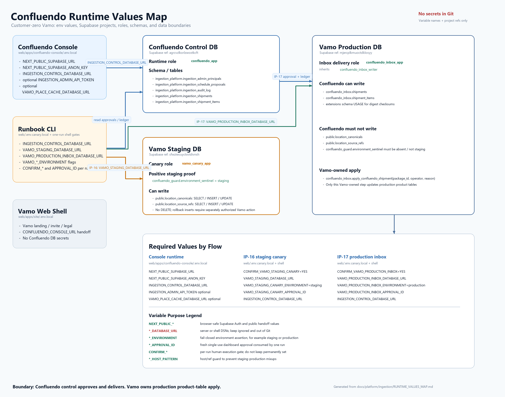
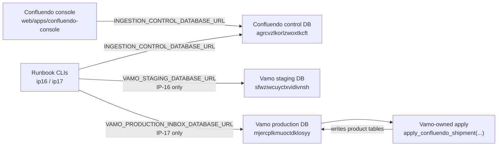

# Confluendo Runtime Values Map

Status: operator reference for customer-zero Vamo setup.

This document maps the runtime values, local env files, Supabase projects,
roles, schemas, and tables used by the Confluendo console and the Vamo staging
and production delivery flows.

It is intentionally **not** a secret inventory. Store real passwords and DSNs in
ignored local env files or a future vault; keep only variable names and
non-secret project identifiers in Git.

Companion diagram:



## Mental Model

Confluendo owns the control plane and delivery tooling. Vamo owns its product
databases and product-table apply step.



## Local Env Files

| File | Owner | Purpose | Must contain | Must not contain |
| --- | --- | --- | --- | --- |
| `web/apps/confluendo-console/.env.local` | Confluendo console runtime | Local Next.js console auth, dashboard reads, and approval API routes | `NEXT_PUBLIC_SUPABASE_URL`, `NEXT_PUBLIC_SUPABASE_ANON_KEY`, `INGESTION_CONTROL_DATABASE_URL`, optional `INGESTION_ADMIN_API_TOKEN`, optional `VAMO_PLACE_CACHE_DATABASE_URL` | Vamo production inbox target DSN unless a server route explicitly owns that flow |
| `web/.env.canary.local` | Operator runbook shell | Local IP-16/IP-17 CLI execution values | `INGESTION_CONTROL_DATABASE_URL`, staging/prod target DSNs, environment flags | Any `NEXT_PUBLIC_*` browser values are unnecessary here |
| `web/apps/site/.env.local` | Vamo web shell | Vamo landing/invite web app | Vamo web public config and `CONFLUENDO_CONSOLE_URL` when needed | Confluendo control DB DSN, Vamo staging DSN, Vamo production inbox DSN |

Both `.env.local` files and `web/.env.canary.local` are local-only and ignored.

## Variable Purpose Legend

Use this legend when deciding where a value belongs and whether it is safe to
share. Values marked server-only or shell-only must never be exposed through
`NEXT_PUBLIC_*` or committed to Git.

| Variable | Purpose | Used by | Secret posture |
| --- | --- | --- | --- |
| `NEXT_PUBLIC_SUPABASE_URL` | Points browser auth clients at the Confluendo control Supabase project. | Confluendo console browser | Public, but Confluendo-owned. |
| `NEXT_PUBLIC_SUPABASE_ANON_KEY` | Browser-safe Supabase publishable/anon key for Auth and MFA session flows. | Confluendo console browser | Public client key; never replace with service-role. |
| `INGESTION_CONTROL_DATABASE_URL` | Server/CLI connection to the Confluendo control plane for proposals, approvals, audit, and shipment ledger. | Console server routes; IP-16/IP-17 CLIs | Server-only secret DSN. |
| `INGESTION_ADMIN_API_TOKEN` | Optional machine-token path for non-human control commands. | Console command API | Server-only secret; avoid in human-only production. |
| `VAMO_PLACE_CACHE_DATABASE_URL` | Optional customer-zero read adapter for Vamo cache metrics. | Console server metrics | Server-only DSN; optional. |
| `CONFLUENDO_CONSOLE_URL` | Lets the Vamo web shell hand operators to the standalone Confluendo console. | Vamo web shell | Public URL, no DB authority. |
| `VAMO_STAGING_DATABASE_URL` | Connects IP-16 to Vamo staging as `vamo_canary_app`. | IP-16 runbook CLI | Shell-only secret DSN. |
| `VAMO_STAGING_CANARY_ENVIRONMENT` | Declares the intended IP-16 execution environment. | IP-16 runbook CLI | Non-secret; must equal `staging`. |
| `VAMO_STAGING_CANARY_APPROVAL_ID` | Identifies the fresh, audited dashboard approval consumed by one staging canary run. | IP-16 runbook CLI | Non-secret but single-use operational value. |
| `VAMO_STAGING_CANARY_REASON` | Optional operator reason to attach to the canary execution. | IP-16 runbook CLI | Non-secret unless the reason text contains sensitive detail. |
| `VAMO_STAGING_CANARY_APPROVAL_MAX_AGE_MINUTES` | Overrides the approval freshness window for IP-16. | IP-16 runbook CLI | Non-secret policy tuning. |
| `VAMO_STAGING_HOST_PATTERN` | Extra host guard so staging and production targets are not confused. | IP-16/IP-17 runbook CLIs | Non-secret safety guard. |
| `CONFIRM_VAMO_STAGING_CANARY` | Final human gate for an IP-16 live staging write. | IP-16 runbook CLI | Non-secret; set per run only. |
| `VAMO_PRODUCTION_INBOX_DATABASE_URL` | Connects IP-17 to Vamo production as `confluendo_inbox_app`, limited to the inbox schema. | IP-17 runbook CLI | Shell-only secret DSN. |
| `VAMO_PRODUCTION_INBOX_ENVIRONMENT` | Declares the intended IP-17 execution environment. | IP-17 runbook CLI | Non-secret; must equal `production`. |
| `VAMO_PRODUCTION_INBOX_APPROVAL_ID` | Identifies the fresh, audited dashboard approval consumed by one production inbox delivery. | IP-17 runbook CLI | Non-secret but single-use operational value. |
| `VAMO_PRODUCTION_INBOX_APPROVAL_MAX_AGE_MINUTES` | Overrides the approval freshness window for IP-17. | IP-17 runbook CLI | Non-secret policy tuning. |
| `CONFIRM_VAMO_PRODUCTION_INBOX` | Final human gate for an IP-17 production inbox delivery. | IP-17 runbook CLI | Non-secret; set per run only. |

## Shared Confluendo Control Values

These values point to the Confluendo control Supabase project.

| Value | Where used | Expected owner/role | Notes |
| --- | --- | --- | --- |
| `NEXT_PUBLIC_SUPABASE_URL` | `web/apps/confluendo-console/.env.local` | Browser-safe Supabase Auth URL | For customer zero, this is the Confluendo control project URL: `https://agrcvzlkorlzwoxtkcft.supabase.co`. |
| `NEXT_PUBLIC_SUPABASE_ANON_KEY` | `web/apps/confluendo-console/.env.local` | Browser-safe publishable/anon key | Used for Supabase Auth session and MFA flows. Do not use service-role keys. |
| `INGESTION_CONTROL_DATABASE_URL` | Console server routes and runbook CLIs | `confluendo_app` or a consciously chosen control DB role | Reads approvals/proposals and records control-plane audit/ledger rows. This is **not** a Vamo DSN. |
| `INGESTION_ADMIN_API_TOKEN` | Optional machine-token path for command API | Server-only | Optional. In production, prefer session-derived admin identity for human operators. |
| `VAMO_PLACE_CACHE_DATABASE_URL` | Console dashboard metrics | Server-only, read-oriented | Optional customer-zero metric adapter. Absence should not block control-plane operation. |

Confluendo control DB:

| Project | Ref | Important schemas/tables | Runtime role |
| --- | --- | --- | --- |
| `confluendo-control` | `agrcvzlkorlzwoxtkcft` | `ingestion_platform.ingestion_admin_principals`, `ingestion_projects`, `ingestion_schedule_proposals`, `ingestion_shipments`, `ingestion_shipment_items`, `ingestion_audit_log` | `confluendo_app` |

## IP-16 Vamo Staging Canary Values

IP-16 writes a tiny, bounded canary directly into **Vamo staging** product
tables. It must never point at production.

| Value | Location | Required value / shape | Purpose |
| --- | --- | --- | --- |
| `CONFIRM_VAMO_STAGING_CANARY` | Shell only for execution | `YES` | Human confirmation gate. Do not keep permanently set. |
| `VAMO_STAGING_DATABASE_URL` | `web/.env.canary.local` or shell | DSN for `vamo_canary_app` against Vamo staging | Target DB for the bounded staging canary. |
| `VAMO_STAGING_CANARY_ENVIRONMENT` | `web/.env.canary.local` or shell | `staging` | Execution safety flag. Anything else fails closed. |
| `VAMO_STAGING_CANARY_APPROVAL_ID` | Shell for each run | Fresh dashboard approval audit id | Approval must be current and single-use. |
| `VAMO_STAGING_CANARY_REASON` | Optional shell | Audit reason text | Falls back to recorded approval reason when available. |
| `VAMO_STAGING_CANARY_APPROVAL_MAX_AGE_MINUTES` | Optional shell/env | Positive integer | Overrides default approval TTL. |
| `VAMO_STAGING_HOST_PATTERN` | Optional shell/env | Defaults to staging ref pattern | Extra guard to avoid using the wrong host. |

Vamo staging DB:

| Project | Ref | Schemas/tables | Role | Expected grants |
| --- | --- | --- | --- | --- |
| Vamo staging | `sfwziwcuyctxvidivnsh` | `confluendo_guard.environment_sentinel` | `vamo_canary_app` | `SELECT` only |
| Vamo staging | `sfwziwcuyctxvidivnsh` | `public.location_canonicals`, `public.location_source_refs` | `vamo_canary_app` | `SELECT`, `INSERT`, `UPDATE`; no `DELETE` |

Staging sentinel:

```sql
select value
from confluendo_guard.environment_sentinel
where key = 'environment';
-- expected: staging
```

## IP-17 Vamo Production Inbox Values

IP-17 delivers a package into **Vamo production** `confluendo_inbox` only.
Confluendo must not write Vamo production product tables.

| Value | Location | Required value / shape | Purpose |
| --- | --- | --- | --- |
| `CONFIRM_VAMO_PRODUCTION_INBOX` | Shell only for execution | `YES` | Human confirmation gate. Do not keep permanently set. |
| `VAMO_PRODUCTION_INBOX_DATABASE_URL` | `web/.env.canary.local` or shell | DSN for `confluendo_inbox_app` against Vamo production | Target DB for production inbox delivery only. |
| `VAMO_PRODUCTION_INBOX_ENVIRONMENT` | `web/.env.canary.local` or shell | `production` | Execution safety flag. Anything else fails closed. |
| `VAMO_PRODUCTION_INBOX_APPROVAL_ID` | Shell for each run | Fresh dashboard approval audit id | Approval must be current and single-use. |
| `VAMO_PRODUCTION_INBOX_APPROVAL_MAX_AGE_MINUTES` | Optional shell/env | Positive integer | Overrides default approval TTL. |
| `VAMO_STAGING_HOST_PATTERN` | Optional shell/env | Defaults to staging ref pattern | Rejects staging-looking target hosts during production delivery. |

Vamo production DB:

| Project | Ref | Schemas/tables | Role | Expected grants |
| --- | --- | --- | --- | --- |
| Vamo production | `mjercplkmuoctdklosyy` | `confluendo_inbox.shipments`, `confluendo_inbox.shipment_items` | `confluendo_inbox_app` inherits `confluendo_inbox_writer` | `SELECT`, `INSERT`; narrow status update |
| Vamo production | `mjercplkmuoctdklosyy` | `extensions` schema | `confluendo_inbox_writer` | `USAGE`, so SQL checksum calculation can call `extensions.digest(...)` |
| Vamo production | `mjercplkmuoctdklosyy` | `public.location_canonicals`, `public.location_source_refs` | `confluendo_inbox_app` | **No product-table write grants** |

Recommended production DSN shape when the direct host is not resolvable:

```env
VAMO_PRODUCTION_INBOX_DATABASE_URL=postgresql://confluendo_inbox_app.mjercplkmuoctdklosyy:<url-encoded-password>@<session-pooler-host>:5432/postgres
```

Use the Supabase **Session pooler** connection string and the
`role.project_ref` username shape. Keep the actual password out of Git.

Production must not carry staging artifacts:

```sql
select to_regclass('confluendo_guard.environment_sentinel') as staging_sentinel;
-- expected: null
```

Digest grant check:

```sql
select has_schema_privilege('confluendo_inbox_writer','extensions','USAGE') as can_digest;
-- expected: true
```

Product-table boundary check:

```sql
select
  has_table_privilege('confluendo_inbox_app', 'public.location_canonicals', 'INSERT, UPDATE, DELETE') as can_write_canonicals,
  has_table_privilege('confluendo_inbox_app', 'public.location_source_refs', 'INSERT, UPDATE, DELETE') as can_write_refs;
-- expected: false, false
```

## Table Position Map

| Database | Schema | Table/function | Who writes | Why it exists |
| --- | --- | --- | --- | --- |
| Confluendo control | `ingestion_platform` | `ingestion_schedule_proposals` | Confluendo control/seed operator | Stores reviewed dry-run proposals that the console renders. |
| Confluendo control | `ingestion_platform` | `ingestion_audit_log` | Console server routes | Records approval decisions and operator context. |
| Confluendo control | `ingestion_platform` | `ingestion_shipments`, `ingestion_shipment_items` | Runbook CLI / control API | Ledger for staging canaries and production inbox deliveries. |
| Vamo staging | `confluendo_guard` | `environment_sentinel` | Vamo DBA/operator only | Positive proof that a target DB is staging. Ingestion code only reads it. |
| Vamo staging | `public` | `location_canonicals`, `location_source_refs` | `vamo_canary_app` for IP-16 only | Bounded staging canary writes. |
| Vamo production | `confluendo_inbox` | `shipments`, `shipment_items` | `confluendo_inbox_app` for IP-17 only | Production delivery inbox controlled by Vamo. |
| Vamo production | `confluendo_inbox` | `apply_confluendo_shipment(...)` | Vamo operator / Vamo-owned execution | Applies inbox package into Vamo product tables. |
| Vamo production | `public` | `location_canonicals`, `location_source_refs` | Vamo-owned apply only | Final product tables. Confluendo target role must not write here. |

## Execution Boundaries

1. Console approvals write only to the Confluendo control DB.
2. IP-16 runbook reads Confluendo approval and writes only to Vamo staging
   product tables through `vamo_canary_app`.
3. IP-17 runbook reads Confluendo approval and writes only to Vamo production
   `confluendo_inbox` through `confluendo_inbox_app`.
4. Vamo production product tables are updated only by the Vamo-owned apply
   function, not by Confluendo.
5. Confirmation flags (`CONFIRM_*`) are per-run shell gates, not persistent
   configuration.
