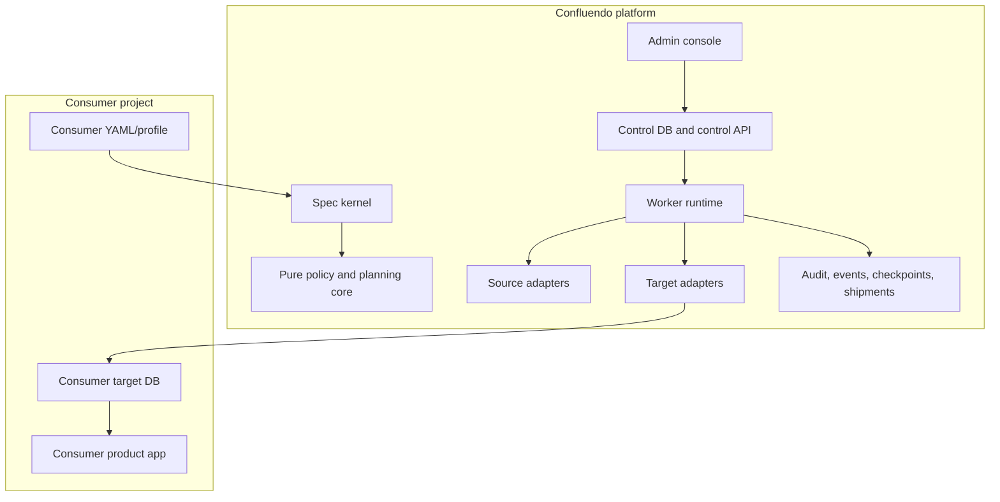
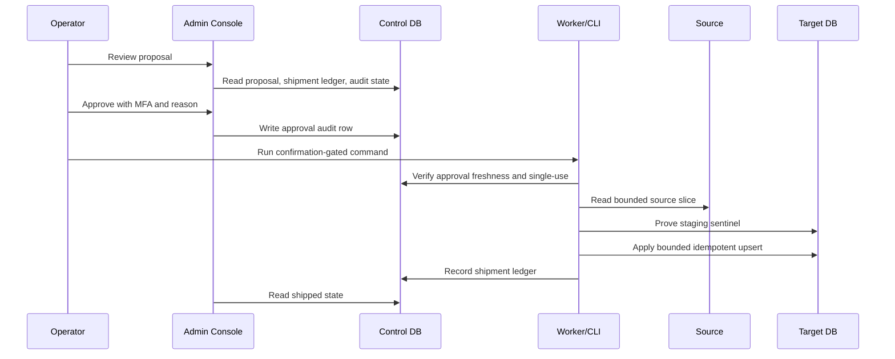

# Confluendo Architecture Deep Dive - Level 400

This document explains the system boundaries and internal contracts that make
Confluendo reusable beyond Vamo.

## Boundary Model

Confluendo is the provider platform.

Vamo is a consumer profile.



Rules:

- platform code lives under `../../../../web/packages/ingestion-platform/`,
- platform docs live under `../`,
- Vamo-specific contracts are data/config, not platform runtime dependencies,
- browser code never receives provider secrets or target DB credentials,
- production writes are not a side effect of staging canary success.

## Runtime Components

### Spec Kernel

The spec kernel parses and validates consumer contracts:

- source adapter,
- source connection,
- target adapter,
- target tables,
- deterministic upsert keys,
- mappings,
- policy requirements,
- safety mode.

The kernel should reject unsafe intent early. Examples: service-role exposure to
browser code, proxy/evasion controls in snapshot specs, missing deterministic
upsert keys, or storage of media bytes when source policy forbids it.

### Core Policy

Core policy is dependency-free TypeScript. It should be deterministic and easy
to test.

It owns:

- target scorecards,
- schedule proposals,
- progressive run state,
- staging canary approval policy,
- admin authorization decisions,
- read-model shaping.

It must not own:

- network calls,
- file system source reads,
- direct Postgres writes,
- provider SDK calls,
- browser-only UI state.

### Adapters

Adapters isolate side effects:

- source adapters read snapshots, fixtures, or future APIs,
- target adapters plan diffs, apply staging canaries, and eventually deliver
  shipment packages,
- storage/control adapters read and write platform tables.

The adapter boundary is where credentials are allowed, never the browser.

### Control DB

The control DB is Confluendo-owned. It records platform state:

- projects,
- specs,
- sources and targets,
- runs and tasks,
- worker leases,
- checkpoints,
- events,
- dead letters,
- policy evaluations,
- schedule proposals,
- audit log,
- shipments and shipment items.

It is not the same thing as a consumer product database.

### Consumer Target DB

The target DB is customer-owned. Confluendo reaches it only through a narrow
delivery contract.

For Vamo staging canary, `vamo_canary_app` can write a tiny bounded package to
Vamo staging after an explicit approval and confirmation-gated run.

For production, Confluendo should use the delivery modes in
`../DATA_DELIVERY_ARCHITECTURE.md`, not the staging canary role.

## Data Flow



The dashboard approval and the target write are intentionally separate.
Approval records the decision. Execution performs the write only when every
gate is present.

## Safety Gates

### Policy Gates

Policy gates answer whether source content can be stored, retained, shipped,
or used only live.

The policy layer must model:

- license and attribution,
- media storage rights,
- provider retention constraints,
- live-only providers,
- PII boundaries,
- promotion thresholds.

### Environment Gates

Staging proof uses a DBA-provisioned target table:

```text
confluendo_guard.environment_sentinel
key = environment
value = staging
```

Code reads this proof. Code must not create it or set it for itself.

Production must not carry a staging sentinel or the staging canary role.

### Operator Gates

Sensitive mutations require:

- active allowlisted principal,
- correct project scope,
- admin/operator role as required,
- MFA/AAL2,
- fresh step-up where required,
- audit reason,
- server-side authorization.

### Ledger Gates

Shipment ledgers prevent repeat execution against the same approval.

The dashboard should also read the ledger so operator state matches execution
state. A proposal can remain `review_required`, but a succeeded shipment for
that proposal must take precedence in the UI.

## Delivery Modes

### Mode A - Consumer Inbox

Mode A writes a package into an isolated consumer inbox schema.

This is the preferred production-grade customer database path because the
consumer owns final product-table apply.

### Mode B - Hosted Confluendo DB/API

Mode B keeps data hosted by Confluendo and exposes a project-scoped read API,
SQL role, export, SDK, or webhook.

This is the low-friction path for customers that do not want Confluendo to have
target DB write credentials.

## Repo Split Readiness

Confluendo currently incubates in the Vamo repo. The future split should move:

```text
web/packages/ingestion-platform/
docs/platform/ingestion/
web/apps/site/app/admin/ingestion/      # only if it becomes platform admin
```

into a standalone Confluendo repo or monorepo.

Before extraction:

- consumer contracts must be data packages,
- platform code must not import Vamo app code,
- docs must label Vamo as a consumer,
- config templates must be Confluendo-owned,
- secrets must move to a proper vault or environment manager,
- delivery modes must not assume one customer schema.

## Change Governance

Any change to Confluendo internals should state the architecture decision:

- inline helper,
- pure core policy,
- adapter/gateway,
- package candidate.

Default to pure core for business rules and adapters for side effects.

Before merging schema-affecting work, follow
`../../../operations/MIGRATION_PROMOTION_POLICY.md`: staging first, targeted
smoke, production promotion or a named blocker with owner and date.

## Review Questions

Use these questions for design review:

1. Does this change keep Confluendo independent from Vamo?
2. Which database receives each write?
3. Can the browser see any secret or target credential?
4. Is the rule tested as pure policy where possible?
5. Does an adapter own every external side effect?
6. Is production delivery separate from staging proof?
7. Does the dashboard read the ledger instead of guessing status?
8. Can the run resume or fail closed?
9. Is attribution durable and row-level where required?
10. Is the rollback or reconciliation path documented?
