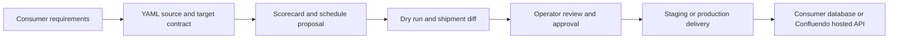

# Confluendo Overview - Level 200

## What Confluendo Is

Confluendo is a reusable ingestion and caching platform. It reads declared data
sources, applies policy and quality checks, creates reviewed shipment packages,
and delivers governed records to consumer projects.

Vamo is the first consumer. Vamo proves the platform with place intelligence:
cities, points of interest, source references, attribution, and cacheable open
dataset rows. Confluendo must stay useful for other consumers whose data has
nothing to do with travel or POIs.

## The Problem

Small and medium products often need high-quality external data, but they do not
have a full data engineering team. They need:

- a way to declare what data they want,
- evidence that a source is legal and safe to cache,
- repeatable ingestion runs with checkpoints,
- a dashboard that explains progress and blockers,
- controlled staging and production delivery,
- a record of what shipped and why.

Confluendo turns this into a platform workflow instead of a one-off scraper.

## The Product Model

Confluendo owns the ingestion process.

The consumer owns the product database and final product behavior.

The platform does not start with "scrape everything." It starts with a target
that has a business reason, source rights, a schema contract, a safe blast
radius, and observable progress.

## Core Concepts

| Concept | Meaning |
| --- | --- |
| Consumer | A customer/project that uses Confluendo output. Vamo is customer zero. |
| Source | A dataset or API that Confluendo can read through a governed adapter. |
| Target | A consumer destination schema, inbox, hosted cache, or API contract. |
| Contract | YAML/config that describes source, mapping, target, policy, and delivery. |
| Scorecard | A policy and value assessment that ranks whether a target should run. |
| Dry run | A no-write execution that produces a shipment diff and blockers. |
| Staging canary | A small approved write to staging, never production. |
| Shipment package | The durable unit of delivery: rows, checksums, attribution, approval, and rollback plan. |
| Ledger | The control-plane record of approvals, shipments, items, events, and audit facts. |

## Why Vamo Staging Is Special

Vamo staging canary writes directly to Vamo staging because it proves the target
adapter end to end with a tiny, bounded package.

That does not define the default production path.

Production delivery should use the governed delivery modes documented in
`../DATA_DELIVERY_ARCHITECTURE.md`:

- Mode A: write a shipment package into a consumer inbox schema, then the
  consumer applies it into product tables.
- Mode B: host the promoted data in Confluendo and let the consumer read it via
  API, SQL role, export, or SDK.

## Safety Model

Confluendo safety is layered:

- open/cacheable sources before durable storage,
- no proxy/VPN/evasion workflows,
- dry run before any target write,
- staging before production,
- admin allowlist and MFA for operator approvals,
- explicit audit reasons,
- target sentinels for staging proof,
- shipment ledgers to prevent replay,
- production delivery separated from staging canary execution.

## What Success Looks Like

A successful Confluendo target can answer:

1. What data are we ingesting?
2. Why is it valuable?
3. Are we allowed to store and ship it?
4. Where is the next checkpoint?
5. What would happen if the worker stops now?
6. What changed in the proposed shipment?
7. Who approved it?
8. Which rows shipped, where, and when?

## Where To Go Next

- Operators should continue to `USAGE_400.md`.
- Platform engineers should continue to `ARCHITECTURE_DEEP_DIVE_400.md`.
- Customer-zero details live in `../bootstrap/README.md` and
  `../STAGING_CANARY_RUNBOOK.md`.
