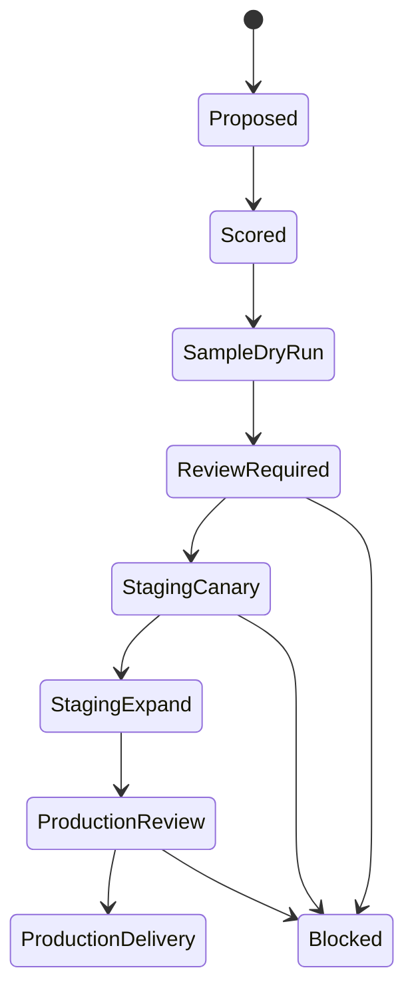

# Confluendo Usage Guide - Level 400

This guide is for operators and implementation engineers. It describes how to
take a consumer target from requirements to a controlled shipment without
confusing Confluendo control-plane writes, staging target writes, and production
delivery.

## Before You Start

Confirm the boundary:

- You are operating Confluendo, the platform.
- Vamo is a consumer instance, not the platform owner.
- Never use production as a proving ground.
- Never run `--execute` or set confirmation variables during readiness checks.
- Never grant Confluendo broad write access to a consumer production database.

## Required Inputs

A consumer target needs:

- consumer key, for example `vamo`,
- use case and expected product value,
- source definition and source rights,
- target schema contract,
- mapping and upsert keys,
- row bounds and stop conditions,
- operator owner,
- delivery mode,
- rollback or reversal plan.

For Vamo place intelligence, the current customer-zero source is a pinned FSQ OS
Places sample. Future sources can be FSQ OS Places snapshots, GeoNames,
Wikidata/Wikimedia, consumer-owned observations, or other sources that pass
policy.

## Lifecycle



### 1. Capture Requirements

Create or update the consumer contract.

For Vamo, contracts and imported fixtures currently live under
`../../../../web/packages/ingestion-platform/fixtures/imported/vamo-place-intelligence/`.

The platform should eventually accept these contracts as a consumer package.
Until the repo split, keep them clearly separated from generic platform runtime
code.

### 2. Score The Target

A target must pass the selection criteria in
`../TARGET_SELECTION_AND_SCHEDULING.md`:

- consumer value,
- source rights,
- target readiness,
- data quality,
- checkpointability,
- cost and quota,
- collision risk,
- blast radius,
- observability.

AI can propose priority and schedules. AI cannot override policy, approval,
license, retention, or production gates.

### 3. Run A Dry Run

Dry run is a no-write proof.

Expected output:

- staged candidate count,
- policy blocks,
- dead letters,
- shipment diff,
- checkpoint report,
- next approval requirement.

For the Vamo IP-16 path:

```powershell
cd Z:\vamo-web-dashboard\web
npm --workspace @vamo/ingestion-platform run ip16:staging-canary
```

Without live confirmation gates, this command must end with `NO WRITE
PERFORMED`.

### 4. Review The Proposal

In the admin dashboard, check:

- source and target,
- geography and category scope,
- reviewed write count,
- diff compatibility,
- policy blocks and dead letters,
- whether the shipment ledger already shows a shipped canary,
- required approval role and MFA state.

Do not approve a target that is already shipped for the same proposal/run.
Create a new proposal/run if new work is needed.

### 5. Approve A Staging Canary

Approval records a decision in the Confluendo control database. It does not
write to Vamo staging by itself.

Requirements:

- active Confluendo admin principal,
- scope includes the consumer project,
- AAL2 MFA,
- fresh step-up,
- non-empty audit reason,
- exact reviewed geography/category/write bound.

The approval creates an audit id. That audit id is then consumed by the
confirmation-gated runbook command.

### 6. Execute A Staging Canary

Only run the live canary when all readiness checks pass.

Required gates:

- `CONFIRM_VAMO_STAGING_CANARY=YES`,
- `VAMO_STAGING_DATABASE_URL` set to staging,
- `VAMO_STAGING_CANARY_ENVIRONMENT=staging`,
- `VAMO_STAGING_CANARY_APPROVAL_ID` set,
- `INGESTION_CONTROL_DATABASE_URL` set,
- `--execute` present,
- staging sentinel row exists,
- production safety checks are clean.

The runbook is `../STAGING_CANARY_RUNBOOK.md`.

### 7. Verify The Ledger

After a successful write, verify:

- target rows exist in staging,
- control ledger has a succeeded shipment,
- shipment key includes the approval id,
- shipment items and counts match the reviewed bounds,
- the dashboard shows already shipped and disables repeat approval.

If target write succeeds but the control ledger fails, stop. Follow the
reconciliation section in `../STAGING_CANARY_RUNBOOK.md`; do not rerun blindly.

### 8. Move Toward Production

Staging canary is not production delivery.

For production, use `../DATA_DELIVERY_ARCHITECTURE.md`.

Preferred production path:

1. Build a shipment package.
2. Deliver to a consumer inbox schema or hosted Confluendo API.
3. Let the consumer own final production apply.
4. Record audit, checksums, row counts, and rollback/reversal.

Do not reuse `vamo_canary_app` for production.

## Operator Checklist

Before approving:

- [ ] Proposal source is live, not sample fallback.
- [ ] Target scope is narrow.
- [ ] Source attribution is present.
- [ ] Shipment diff is compatible.
- [ ] No delete is included unless explicitly approved by a later policy.
- [ ] Dashboard does not show already shipped.
- [ ] MFA step-up is fresh.
- [ ] Audit reason names why this canary is happening now.

Before executing:

- [ ] Staging readiness checks pass.
- [ ] Production safety checks pass.
- [ ] Approval id is current and unused.
- [ ] Confirmation gate is intentional.
- [ ] `--execute` is intentional.
- [ ] Rollback/reconciliation owner is known.

After executing:

- [ ] Shipment ledger row exists.
- [ ] Dashboard shows shipped state.
- [ ] Target rows match expected source ids.
- [ ] No production objects changed.
- [ ] Follow-up expansion or production review is documented.

## Common Failure Modes

| Symptom | Meaning | Action |
| --- | --- | --- |
| Dashboard shows sample preview | Control DB has no live proposal row or read failed. | Seed/fix control DB, then re-check read-only. |
| Fresh MFA required | Step-up timestamp is stale or missing. | Re-verify MFA and retry within the window. |
| Diff drifted from review | Target no longer matches reviewed diff. | Verify target rows and ledger; create a new proposal/run if needed. |
| Staging proof missing | Target DB lacks sentinel row or role access. | Apply staging bootstrap, never self-set proof in code. |
| Production safety blocked | Production cannot be proven clean. | Stop. Verify production before any canary. |
