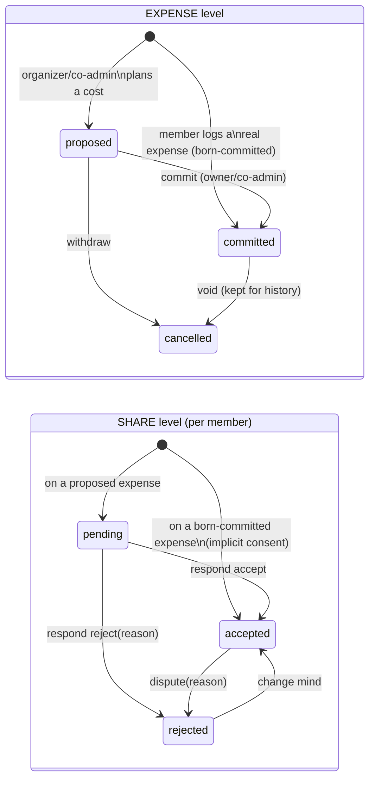

# Expense + share consent lifecycle

Source: `docs/design/MONEY_GOVERNANCE.md` D1 (+ A1 dispute window) ·
implements in S19. Contract for the money state machine — review against it.

One-sentence contract: **only committed expenses hit balances; every share
carries a consent state that annotates but never gates the math; rejection
is a visible flag, not a deletion.**

## Two-level state machine

## The two invariants that bite (review focus)

1. **Balances filter on EXPENSE status, not SHARE response.**
   `trip_balances` counts `paid`/`owed` only from `status = 'committed'`
   expenses. A **rejected share still counts** in `owed` — it is included
   with a flag, never subtracted. Excluding rejected shares = adjudication
   by stealth (constitution §2, hard display rule). The ONLY status that
   leaves the math is `cancelled` (and `proposed`, which never entered).

2. **Share responses are NOT gated by `is_trip_writable`.**
   Per A1 + interaction matrix, a member may dispute (reject) **after close**.
   So `respond_to_share` writes are allowed in `active/closing/closed/
   unresolved` (like `settlements` — blocked only in `cancelled`). Do NOT copy
   the S17 expense-write gate here. Expense status transitions (propose/commit/
   void) DO respect writability.

   **Window close (S22, not S19):** A1's full rule is "open until that member
   confirms their *own* settlement". S19 implements the close-trip-still-open
   half; the settlement-confirm cutoff lands with the S22 settle-confirm flow
   (the semantics of "confirming your own settlement" are defined there).
   Until S22, S19 leaves the window open through `closed`/`unresolved`.

## Integrity rules (RPC-only consent writes)

3. **Direct inserts must be exactly default consent.** The share guard must
   block a non-RPC INSERT that sets `response='rejected'`, any
   `response_reason`, or any `responded_at` — not just `pending`. A direct
   insert may only produce `accepted` / null / null (born-committed default);
   `pending` is allowed only under the propose-RPC flag. Otherwise a client
   can forge a disputed share bypassing `respond_to_share`, and "response
   writes are RPC-only" is a lie.

4. **A dispute must reach other devices.** `respond_to_share` touches only
   `expense_shares`; realtime/sync must refresh on that. Either subscribe to
   `expense_shares` (membership-filtered) OR have the RPC touch the parent
   `expenses` row so the existing expenses subscription fires. A dispute that
   only the disputer can see breaks the hard display rule across the group.

## Permission matrix

| Action | Who | Writability gate |
|---|---|---|
| Create proposed expense | owner / co-admin | `is_trip_writable` |
| Commit proposed | owner / co-admin | `is_trip_writable` |
| Log born-committed expense | any active member | `is_trip_writable` |
| Cancel/void expense | owner / co-admin | `is_trip_writable` |
| Respond to own share (accept/reject+reason) | any active member, own share only | **NOT gated** — open until own settle-confirm (A1) |

## Hard display rule (carried from constitution)

A disputed/pending share must never render like an accepted one. Wherever a
share contributes — balances, settle-up sheet, close report — show
"included — disputed by <name>". The flag is what keeps the deterministic
math honest.

## rls_smoke cases (state-based)

- proposed expense does NOT change `trip_balances.net_cents`; committing it does
- rejected share still contributes to `owed` (net unchanged by reject vs accept)
- cancelled expense leaves the math
- member rejects own share on a **closed** trip → ALLOWED (A1)
- member rejects own share on a **cancelled** trip → blocked
- member cannot respond to another member's share
- non-admin member cannot commit a proposed expense
- born-committed expense: own share defaults `accepted`, others `accepted`
- direct (non-RPC) insert of a share with `response='rejected'` or a
  `response_reason`/`responded_at` → **blocked** (forged-dispute guard)
- the cancelled-dispute case must dispute an expense **inside the cancelled
  trip** — not one on a different (closed) trip
