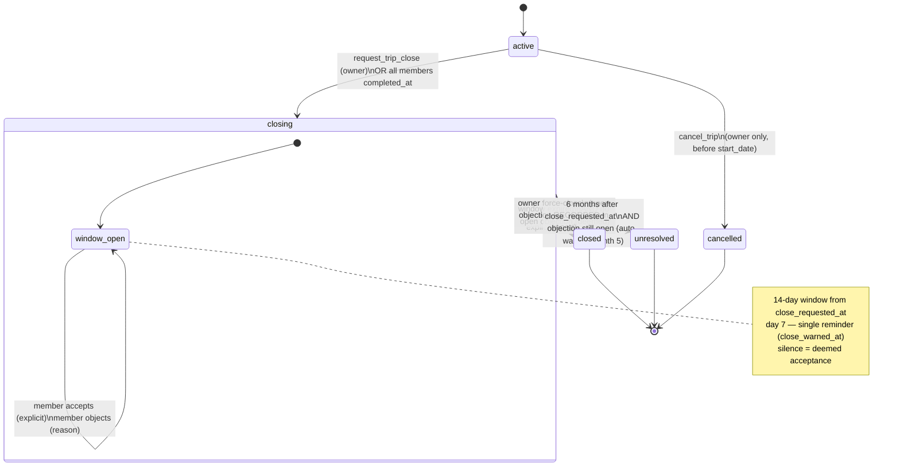
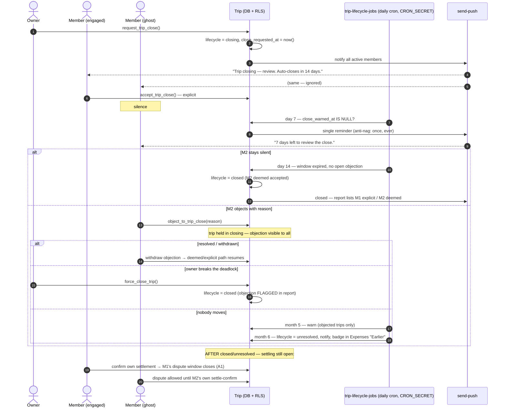

# Trip closure — deemed acceptance

Source: `docs/design/MONEY_GOVERNANCE.md` D2 (amended 2026-06-05) ·
rationale `docs/design/CLOSURE_PATTERNS.md` · implements in S17.

The one-sentence contract: **closing a trip stops new spending after a
14-day silence-is-consent window; financial finality arrives later, per
member, at their own settlement confirm — and dissent is always loud.**

## Lifecycle state machine

## What each state permits

| | new expenses / captures / plan edits | settlements | disputes (share rejection) |
|---|---|---|---|
| `active` | ✅ | ✅ | ✅ |
| `closing` | ✅ (trip is still live) | ✅ | ✅ |
| `closed` | ❌ (RLS-blocked) | ✅ **stays open** | ✅ until own settle-confirm (A1) |
| `unresolved` | ❌ | ✅ | ✅ until own settle-confirm |
| `cancelled` | ❌ | ❌ | — |

Construction analogy (see CLOSURE_PATTERNS P4): `closed` = practical
completion ("no new work"), the post-close settling period = defects
liability period, per-member settlement confirm = final certificate.

## The dance, end to end

## Invariants (review checklist)

1. **Silence never blocks; only a reasoned objection does.** No path waits
   indefinitely on a non-responder.
2. **Deemed ≠ hidden.** Close report always distinguishes explicit accept /
   deemed accept / objected-then-forced. Never merged.
3. **`settlements` writable in `closing`/`closed`/`unresolved`** — blocked
   only in `cancelled`. (The banner says "settling still open"; RLS must
   agree.)
4. **One reminder, ever** (`close_warned_at`). Daily cron must be idempotent
   — re-running a day never re-sends.
5. **`unresolved` is reachable ONLY via an open objection.** A trip with all
   silence closes clean at day 14.
6. **Force-close never erases the objection** — it travels into the report
   (squeeze-out with appraisal rights).
7. Lifecycle transitions happen **only via RPCs** (`request_trip_close`,
   `accept_trip_close`, `object_to_trip_close`, `force_close_trip`,
   `cancel_trip`, deemed-close job) — never direct column updates by members.
8. Cron job authenticates with `x-cron-secret` (never the bare heartbeat
   pattern) and records `record_job_heartbeat` per run.

## rls_smoke cases (state-based, per the "no error ≠ it worked" rule)

- Member INSERT/UPDATE/**DELETE** expense on closed trip → **blocked**
  (DELETE matters: `FOR ALL` policies apply USING to deletes — found in
  S17 review)
- Member settlement write (own, as participant) on closed trip → **ALLOWED**
- Member writes a settlement **between two other members** → **blocked**
  (0007 participant-scoping regression lock)
- Any write on cancelled trip → **blocked** (incl. settlements)
- Deemed close: window expired + silent member → lifecycle = `closed`
- Open objection at window expiry → lifecycle stays `closing`
- All members mark complete → lifecycle auto-enters `closing`
- Member early-accept completes → `closed` (member-driven transition must
  pass the lifecycle guard — S17 review finding)
- Co-admin cannot cancel/close/force (owner-only transitions)

## Sequencing constraint (S17 review P2)

**No notice, no deemed consent**: the day-14 deemed close must not run in
production before lifecycle push notifications exist (S22). Until then,
either the cron schedule stays off or S22's notify path ships first.
